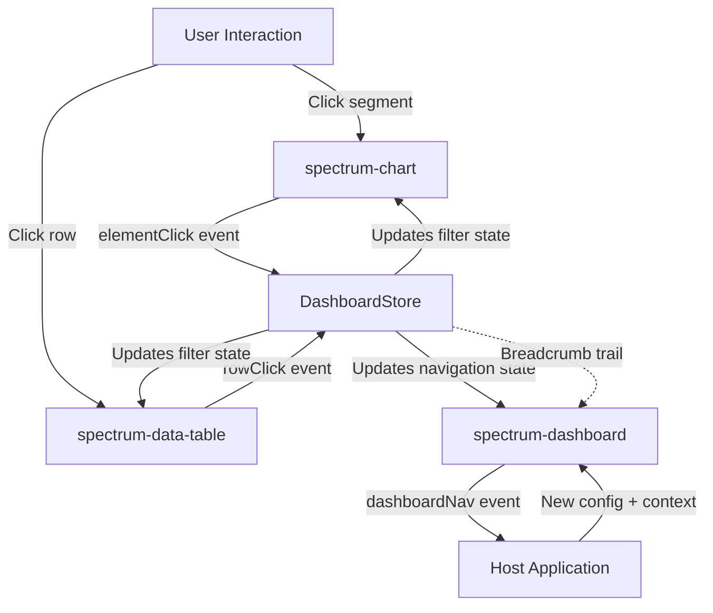

# Comprehensive Drill-Down Dashboard System

## Overview

Implement a complete drill-down system that supports all interaction patterns: cross-widget filtering, hierarchical navigation, detail panels, and dashboard navigation. The system will leverage the existing `DashboardStore` navigation infrastructure and extend chart/table components with drill-down capabilities.

## Architecture Diagram




## Implementation Plan

### Phase 1: Enhance Chart Click Events

**File**: [`packages/core/src/components/spectrum-chart/spectrum-chart.tsx`](packages/core/src/components/spectrum-chart/spectrum-chart.tsx)Add click event handling to charts for drill-down:

1. **Add Event Emitters** (after line 93):
```typescript
@Event({
  eventName: 'elementClick',
  bubbles: true,
  composed: true,
}) elementClick: EventEmitter<ChartElementClickEvent>;

@Event({
  eventName: 'legendClick',
  bubbles: true,
  composed: true,
}) legendClick: EventEmitter<ChartLegendClickEvent>;
```


2. **Add Click Handler Configuration** in `createChart()` method (around line 250):
```typescript
// In chart options
onClick: (event, elements, chart) => {
  if (elements.length > 0) {
    const element = elements[0];
    const datasetIndex = element.datasetIndex;
    const index = element.index;
    const dataset = chart.data.datasets[datasetIndex];
    const label = chart.data.labels[index];
    const value = dataset.data[index];
    
    this.elementClick.emit({
      action: 'elementClick',
      chartType: this.effectiveType,
      datasetLabel: dataset.label,
      label: label,
      value: value,
      datasetIndex: datasetIndex,
      elementIndex: index,
      rawData: this.parsedData.datasets[datasetIndex].data[index]
    });
  }
}
```


3. **Add TypeScript Interfaces** in [`packages/core/src/components/spectrum-chart/types/chart.types.ts`](packages/core/src/components/spectrum-chart/types/chart.types.ts):
```typescript
export interface ChartElementClickEvent {
  action: 'elementClick';
  chartType: string;
  datasetLabel?: string;
  label: any;
  value: any;
  datasetIndex: number;
  elementIndex: number;
  rawData?: any;
}

export interface ChartLegendClickEvent {
  action: 'legendClick';
  datasetLabel: string;
  datasetIndex: number;
  hidden: boolean;
}
```


### Phase 2: Enhance Table Row Click Events

**File**: [`packages/core/src/components/spectrum-data-table/spectrum-data-table.tsx`](packages/core/src/components/spectrum-data-table/spectrum-data-table.tsx)The table already has `rowClick` event. Enhance the payload (around line 330):

```typescript
// Update handleRowClick to include more context
private handleRowClick(row: any, index: number) {
  this.rowClick.emit({
    action: 'rowClick',
    row: row,
    rowIndex: index,
    currentPage: this.currentPage,
    globalIndex: (this.currentPage - 1) * this.effectivePageSize + index,
    allData: this.sortedData
  });
}
```


### Phase 3: Create Drill-Down Configuration Types

**File**: [`packages/core/src/components/spectrum-dashboard/types/dashboard.types.ts`](packages/core/src/components/spectrum-dashboard/types/dashboard.types.ts)Add drill-down configuration types (around line 100):

```typescript
/**
    * Drill-down action types
 */
export type DrillDownAction = 
  | 'cross-filter'      // Update filters in current dashboard
  | 'hierarchical-nav'  // Navigate to detail level with breadcrumbs
  | 'detail-panel'      // Show detail modal/panel
  | 'dashboard-nav';    // Navigate to different dashboard

/**
    * Drill-down configuration for widgets
 */
export interface DrillDownConfig {
  /** Type of drill-down action */
  action: DrillDownAction;
  
  /** Target view ID (for navigation actions) */
  targetView?: string;
  
  /** Filter mappings for cross-filter action */
  filterMappings?: {
    [sourceField: string]: string; // Map clicked field to filter key
  };
  
  /** Context to pass to target view */
  contextMapping?: {
    [contextKey: string]: string; // Map clicked data to context keys
  };
  
  /** Whether to preserve current filters */
  preserveFilters?: boolean;
  
  /** Custom breadcrumb label template */
  breadcrumbLabel?: string; // e.g., "Region: {label}"
  
  /** Detail panel configuration */
  detailPanel?: {
    title?: string;
    component?: string;
    width?: string;
  };
}

/**
    * Widget definition with drill-down support
 */
export interface WidgetDefinition {
  // ... existing properties ...
  
  /** Drill-down configuration */
  drillDown?: DrillDownConfig;
}
```


### Phase 4: Create Drill-Down Manager Service

**File**: `packages/core/src/components/spectrum-dashboard/services/drill-down-manager.ts` (NEW)

```typescript
import DashboardStore from '../store/dashboard.store';
import type { DrillDownConfig, DrillDownAction } from '../types/dashboard.types';

export class DrillDownManager {
  /**
            * Process drill-down action from widget event
   */
  public static processDrillDown(
    config: DrillDownConfig,
    eventData: any,
    sourceWidget: string
  ): void {
    switch (config.action) {
      case 'cross-filter':
        this.handleCrossFilter(config, eventData);
        break;
      
      case 'hierarchical-nav':
        this.handleHierarchicalNav(config, eventData, sourceWidget);
        break;
      
      case 'detail-panel':
        this.handleDetailPanel(config, eventData);
        break;
      
      case 'dashboard-nav':
        this.handleDashboardNav(config, eventData, sourceWidget);
        break;
    }
  }
  
  /**
            * Handle cross-widget filtering
   */
  private static handleCrossFilter(config: DrillDownConfig, eventData: any): void {
    if (!config.filterMappings) return;
    
    const filters: Record<string, any> = {};
    
    // Map event data to filters
    Object.entries(config.filterMappings).forEach(([sourceField, filterKey]) => {
      if (eventData[sourceField] !== undefined) {
        filters[filterKey] = eventData[sourceField];
      }
    });
    
    // Update store filters
    DashboardStore.updateFilters(filters);
  }
  
  /**
            * Handle hierarchical navigation with breadcrumbs
   */
  private static handleHierarchicalNav(
    config: DrillDownConfig,
    eventData: any,
    sourceWidget: string
  ): void {
    if (!config.targetView) return;
    
    // Build context from mapping
    const context = this.buildContext(config.contextMapping, eventData);
    
    // Preserve current filters if configured
    if (config.preserveFilters) {
      context.filters = DashboardStore.getFilters();
    }
    
    // Build breadcrumb
    const breadcrumb = this.buildBreadcrumb(config, eventData);
    
    // Navigate with breadcrumb trail
    DashboardStore.navigate(config.targetView, context, breadcrumb);
  }
  
  /**
            * Handle detail panel display
   */
  private static handleDetailPanel(config: DrillDownConfig, eventData: any): void {
    // Update context with detail data
    DashboardStore.updateContext({
      detailPanel: {
        visible: true,
        data: eventData,
        config: config.detailPanel
      }
    });
  }
  
  /**
            * Handle dashboard navigation
   */
  private static handleDashboardNav(
    config: DrillDownConfig,
    eventData: any,
    sourceWidget: string
  ): void {
    if (!config.targetView) return;
    
    const context = this.buildContext(config.contextMapping, eventData);
    DashboardStore.navigate(config.targetView, context);
  }
  
  /**
            * Build context from mapping
   */
  private static buildContext(
    mapping: Record<string, string> | undefined,
    eventData: any
  ): Record<string, any> {
    if (!mapping) return { sourceData: eventData };
    
    const context: Record<string, any> = {};
    Object.entries(mapping).forEach(([contextKey, sourceField]) => {
      if (eventData[sourceField] !== undefined) {
        context[contextKey] = eventData[sourceField];
      }
    });
    
    return context;
  }
  
  /**
            * Build breadcrumb trail
   */
  private static buildBreadcrumb(
    config: DrillDownConfig,
    eventData: any
  ): Array<{ label: string; viewId: string; context?: Record<string, any> }> {
    // Get current navigation state
    const currentNav = DashboardStore.getNavigation();
    const existingCrumbs = currentNav?.breadcrumb || [];
    
    // Create label from template
    let label = config.breadcrumbLabel || eventData.label || 'Detail';
    Object.keys(eventData).forEach(key => {
      label = label.replace(`{${key}}`, eventData[key]);
    });
    
    // Add current view to breadcrumb
    return [
      ...existingCrumbs,
      {
        label: label,
        viewId: config.targetView!,
        context: this.buildContext(config.contextMapping, eventData)
      }
    ];
  }
}
```


### Phase 5: Integrate Drill-Down in Dashboard Widget Host

**File**: [`packages/core/src/components/dashboard-widget-host/dashboard-widget-host.tsx`](packages/core/src/components/dashboard-widget-host/dashboard-widget-host.tsx)Add event listeners for drill-down (around line 150):

```typescript
componentDidLoad() {
  // ... existing code ...
  
  // Listen for chart click events
  this.element.addEventListener('elementClick', (e: CustomEvent) => {
    if (this.widgetConfig.drillDown) {
      DrillDownManager.processDrillDown(
        this.widgetConfig.drillDown,
        e.detail,
        this.widgetConfig.id
      );
    }
  });
  
  // Listen for table row click events
  this.element.addEventListener('rowClick', (e: CustomEvent) => {
    if (this.widgetConfig.drillDown) {
      DrillDownManager.processDrillDown(
        this.widgetConfig.drillDown,
        e.detail,
        this.widgetConfig.id
      );
    }
  });
}
```


### Phase 6: Create Breadcrumb Navigation Component

**File**: `packages/core/src/components/spectrum-breadcrumb/spectrum-breadcrumb.tsx` (NEW)

```typescript
@Component({
  tag: 'spectrum-breadcrumb',
  styleUrl: 'spectrum-breadcrumb.scss',
  shadow: false,
})
export class SpectrumBreadcrumb {
  @Prop() items: Array<{ label: string; viewId: string; context?: any }> = [];
  
  @Event() breadcrumbClick: EventEmitter<{ viewId: string; context: any }>;
  
  private handleClick(item: any, index: number) {
    // Navigate back to this level
    this.breadcrumbClick.emit({
      viewId: item.viewId,
      context: item.context
    });
  }
  
  render() {
    return (
      <nav class="spectrum-breadcrumb" aria-label="Breadcrumb">
        <ol class="spectrum-breadcrumb__list">
          {this.items.map((item, index) => (
            <li class="spectrum-breadcrumb__item">
              {index < this.items.length - 1 ? (
                <button
                  class="spectrum-breadcrumb__link"
                  onClick={() => this.handleClick(item, index)}
                >
                  {item.label}
                </button>
              ) : (
                <span class="spectrum-breadcrumb__current">{item.label}</span>
              )}
              {index < this.items.length - 1 && (
                <span class="spectrum-breadcrumb__separator">/</span>
              )}
            </li>
          ))}
        </ol>
      </nav>
    );
  }
}
```


### Phase 7: Update Storybook with Drill-Down Examples

**File**: [`packages/storybook/src/stories/components/spectrum-dashboard/spectrum-dashboard.stories.tsx`](packages/storybook/src/stories/components/spectrum-dashboard/spectrum-dashboard.stories.tsx)Add comprehensive drill-down examples:

1. **Cross-Filter Example**: Click pie chart segment to filter table by region
2. **Hierarchical Navigation**: Click region to drill into region details with breadcrumb
3. **Detail Panel**: Click table row to show detail modal
4. **Dashboard Navigation**: Click KPI card to navigate to detailed dashboard

Example JSON configuration:

```json
{
  "id": "sales-dashboard",
  "widgets": [
    {
      "id": "regional-sales-chart",
      "type": "pie-chart",
      "area": "chart1",
      "drillDown": {
        "action": "cross-filter",
        "filterMappings": {
          "label": "region"
        }
      }
    },
    {
      "id": "sales-table",
      "type": "data-table",
      "area": "table",
      "drillDown": {
        "action": "hierarchical-nav",
        "targetView": "product-detail",
        "breadcrumbLabel": "Product: {product}",
        "contextMapping": {
          "productId": "id",
          "productName": "product"
        },
        "preserveFilters": true
      }
    }
  ]
}
```


## Implementation Todos

- Add chart click event emitters and handlers
- Enhance table row click payload with more context
- Create drill-down configuration types and interfaces
- Implement DrillDownManager service with all action types
- Integrate drill-down event handling in widget host
- Create breadcrumb navigation component
- Update Complete Dashboard story with drill-down examples
- Create dedicated drill-down Storybook stories for each pattern
- Add comprehensive documentation for drill-down configuration
- Update dependency map with new components

## Testing Strategy

1. **Unit Tests**: Test DrillDownManager logic for each action type
2. **Integration Tests**: Test event flow from chart/table through store
3. **E2E Tests**: Test complete drill-down scenarios in Storybook
4. **Accessibility Tests**: Ensure breadcrumb navigation is keyboard accessible

## Benefits

- **Flexible**: Supports all drill-down patterns via configuration
- **Decoupled**: Components don't know about each other
- **Extensible**: Easy to add new drill-down action types