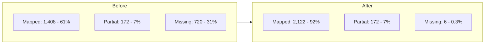

# Full Component Swap Readiness

## Critical Discovery

5 of the 11 "missing" components **already exist** in `packages/core/src/components/`:

- `spectrum-progress` -- 348 audit instances, EXISTS with circular/linear variants
- `spectrum-radio` -- 310 audit instances, EXISTS with primary/positive/caution/destructive variants
- `spectrum-checkbox` -- EXISTS (0 audit instances but should still be mapped)
- `spectrum-tabs` -- EXISTS with primary/secondary variants
- `spectrum-tooltip` -- EXISTS with plain/rich variants

**Impact:** Updating the mapping alone converts 658 of 720 "missing" instances to "mapped", bringing swap readiness from 61% to 90%.

---

## Step 1: Fix the Component Mapping (code changes)

### 1a. Update `[m3-to-spectrum-component-mapping.json](packages/core/src/tokens/m3-to-spectrum-component-mapping.json)`

Change status from `"missing"` to `"mapped"` and add variant mappings for:

- **Progress Indicator** -> `spectrum-progress`, variants: `{ "Circular": { variant: "circular" }, "Linear": { variant: "linear" } }`
- **Radio Button** -> `spectrum-radio`, variants: `{ "default": {} }` (M3 radio has no style variants, just checked/enabled states)
- **Checkbox** -> `spectrum-checkbox`, variants: `{ "default": {} }`
- **Tabs** -> `spectrum-tabs`, variants: `{ "Primary": { variant: "primary" }, "Secondary": { variant: "secondary" } }`
- **Tooltip** -> `spectrum-tooltip`, variants: `{ "Plain": { variant: "plain" }, "Rich": { variant: "rich" } }`

Update summary counts: mapped 22, partial 6, missing 6, total 34.

### 1b. Update `COMPONENT_MAP` in `[spectrum-figma-plugin/src/code.ts](spectrum-figma-plugin/src/code.ts)`

Change the 5 entries from `spectrum: null, status: 'missing'` to their correct mappings with variant maps. Example for Progress Indicator:

```typescript
'Progress Indicator': {
  spectrum: 'spectrum-progress',
  status: 'mapped',
  notes: 'M3 Circular/Linear map to Spectrum variant prop',
  variantMap: {
    'Circular': { variant: 'circular' },
    'Linear':   { variant: 'linear' },
  },
},
```

### 1c. Rebuild the plugin

```bash
cd spectrum-figma-plugin && npm run build
```

---

## Step 2: Build spectrum-segmented-button (56 audit instances)

Only truly missing high-impact component. Scaffold and implement:

```bash
cd packages/core && npm run generate spectrum-segmented-button
```

**Props to implement** (based on M3 behavior):

- `items: SegmentItem[]` -- array of `{ label, icon?, value, disabled? }`
- `selectedIndex: number` -- currently selected segment (mutable)
- `multiSelect: boolean` -- allow multiple selection (default false)
- `size: 'sm' | 'base' | 'lg'` -- size variant
- `disabled: boolean`

**Events:** `segmentChange` with `{ index, value, selected }`

**Structure:** Renders as a group of buttons with shared border-radius, uses existing `spectrum-button` styling internally. Follows the pattern of `spectrum-tabs` (item array, selected index, keyboard nav).

After building, update both mapping files and the plugin `COMPONENT_MAP`:

```typescript
'Segmented Button': {
  spectrum: 'spectrum-segmented-button',
  status: 'mapped',
  notes: '',
  variantMap: {},
},
```

---

## Step 3: Create Spectrum Component Masters in Figma

For Command 9 (Swap) to work, matching Figma component masters must exist in the file. Each should be a **Component Set** with variant properties matching the Spectrum code props.

### Components to create in Figma (priority order by instance count):

**Tier 1 -- High instance count (2,000+ combined):**

- **spectrum-button** (930 instances: Icon Button + Button + FAB)
  - Variant props: `variant` (primary, secondary, ghost, outline, fab), `size` (sm, base, lg), `iconOnly` (true, false)
- **spectrum-progress** (348 instances, newly mapped)
  - Variant props: `variant` (circular, linear), `size` (sm, base, lg), `color` (primary, secondary, success, warning, danger)
- **spectrum-radio** (310 instances, newly mapped)
  - Variant props: `variant` (primary, positive, caution, destructive), `size` (sm, base, lg), `checked` (true, false)
- **spectrum-rail** (174 instances)
  - Single default component (no variant properties needed)
- **spectrum-switch** (150 instances)
  - Variant props: `variant` (primary, positive, caution, destructive), `checked` (true, false)

**Tier 2 -- Medium instance count:**

- **spectrum-search-input** (104 instances)
  - Single component, no variants needed
- **spectrum-chip** (69 instances)
  - Variant props: `variant` (assist, filter, input, suggestion)
- **spectrum-segmented-button** (56 instances, after building in code)
  - Single component or variant set
- **spectrum-app-layout** (46 instances, partial)
  - Single layout component
- **spectrum-toast** (32 instances)
  - Single component

**Tier 3 -- Low instance count:**

- **spectrum-menu** (41 instances) -- single component
- **spectrum-select** (12 instances) -- variant props: `variant` (primary, outline)
- **spectrum-sidebar** (12 instances) -- variant props: `position` (left, right), `overlay` (true, false)
- **spectrum-text-input** (10 instances) -- single component
- **spectrum-badge** (0 in audit but mapped) -- variant props: `size` (small, large)

### Figma naming convention

The plugin searches for components by **exact name match** against the `spectrum` field in `COMPONENT_MAP`. For component sets:

- Component set name: `spectrum-button`
- Variant children named: `variant=primary, size=base, iconOnly=false`

The plugin parses comma-separated `key=value` pairs from variant component names.

---

## Step 4: Run the Swap

After Steps 1-3:

1. Re-run **Command 8 (Audit)** to verify the updated mapping shows fewer "missing"
2. Run **Command 9 (Swap)** -- it will swap all instances where a matching Figma component exists
3. The report will tell you which components are still not in the file
4. Add more Figma components incrementally and re-run Command 9

---

## Remaining Truly Missing Components (low priority)

These have 0-4 audit instances and can be deferred:

- Carousel (4 instances) -- needs `spectrum-carousel`
- Bottom Sheet (2 instances) -- could use `spectrum-dialog size="full"`
- Slider (0 instances) -- needs `spectrum-slider`
- Divider (0 instances) -- CSS utility
- Date Picker, Time Picker, Bottom Navigation Bar (0 instances each)

---

## Revised Swap Readiness After This Plan




