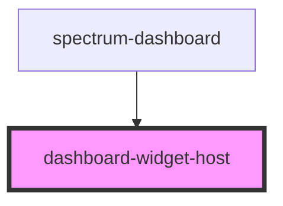

# dashboard-widget-host

<!-- Auto Generated Below -->

## Properties

| Property                         | Attribute             | Description                                  | Type                                 | Default     |
| -------------------------------- | --------------------- | -------------------------------------------- | ------------------------------------ | ----------- |
| `area` _(required)_              | `area`                | Grid area name for CSS Grid positioning      | `string`                             | `undefined` |
| `dataSourceManager` _(required)_ | `data-source-manager` | Data source manager instance                 | `DataSourceManager`                  | `undefined` |
| `dataSources`                    | `data-sources`        | Available data sources from dashboard config | `{ [x: string]: DataSourceConfig; }` | `{}`        |
| `debug`                          | `debug`               | Debug mode                                   | `boolean`                            | `false`     |
| `globalContext`                  | `global-context`      | Global context (userId, authToken, etc.)     | `{ [x: string]: any; }`              | `{}`        |
| `widgetConfig` _(required)_      | `widget-config`       | Widget configuration                         | `WidgetDefinition`                   | `undefined` |

## Dependencies

### Used by

 - [spectrum-dashboard](../spectrum-dashboard)

### Graph

----------------------------------------------

