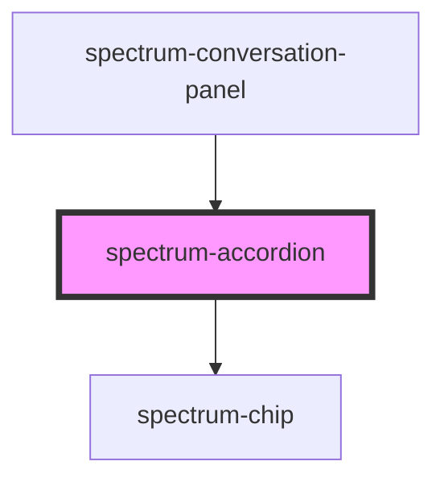

# spectrum-accordion

<!-- Auto Generated Below -->

## Properties

| Property           | Attribute           | Description                                                          | Type                       | Default                                                      |
| ------------------ | ------------------- | -------------------------------------------------------------------- | -------------------------- | ------------------------------------------------------------ |
| `accordionId`      | `accordion-id`      | Unique identifier for the accordion                                  | `string`                   | `` `accordion-${Math.random().toString(36).substr(2, 9)}` `` |
| `collapsedIcon`    | `collapsed-icon`    | The icon to show when collapsed Default: 'arrow_drop_down'           | `string`                   | `'arrow_drop_down'`                                          |
| `debug`            | `debug`             | Whether to enable debug logging                                      | `boolean`                  | `false`                                                      |
| `disabled`         | `disabled`          | Whether the accordion should be disabled Default: false              | `boolean`                  | `false`                                                      |
| `expanded`         | `expanded`          | Whether the accordion is expanded Default: false                     | `boolean`                  | `false`                                                      |
| `expandedIcon`     | `expanded-icon`     | The icon to show when expanded Default: 'arrow_drop_up'              | `string`                   | `'arrow_drop_up'`                                            |
| `haptic`           | `haptic`            | Whether to enable haptic feedback Default: false                     | `boolean`                  | `false`                                                      |
| `horizontalScroll` | `horizontal-scroll` | Whether to show content in horizontal scroll container Default: true | `boolean`                  | `true`                                                       |
| `label`            | `label`             | The label for the accordion trigger Default: 'Dive Deeper'           | `string`                   | `'Dive Deeper'`                                              |
| `outline`          | `outline`           | Whether the trigger chip should be outlined Default: true            | `boolean`                  | `true`                                                       |
| `sound`            | `sound`             | Whether to enable sound effects Default: false                       | `boolean`                  | `false`                                                      |
| `variant`          | `variant`           | The variant of the trigger chip Default: 'secondary'                 | `"primary" \| "secondary"` | `'secondary'`                                                |

## Events

| Event             | Description                                 | Type                                                       |
| ----------------- | ------------------------------------------- | ---------------------------------------------------------- |
| `accordionToggle` | Event emitted when the accordion is toggled | `CustomEvent<{ expanded: boolean; accordionId: string; }>` |

## Dependencies

### Used by

 - [spectrum-conversation-panel](../spectrum-conversation-panel)

### Depends on

- [spectrum-chip](../spectrum-chip)

### Graph

----------------------------------------------

