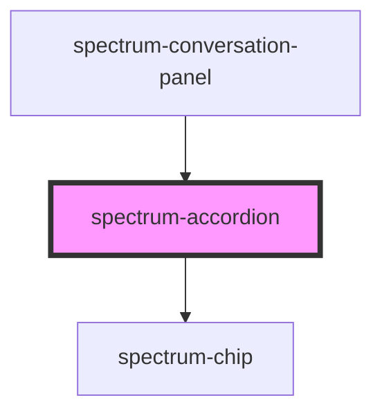

# spectrum-accordion

The `spectrum-accordion` component provides two distinct variants for organizing and displaying expandable content:

## Variants

### Chip Variant
A trigger-based accordion using a chip button for expansion. Ideal for collapsing/expanding additional content or actions.

### Standard Variant (Default)
A traditional multi-section accordion with configurable expand behavior. Perfect for FAQ sections, navigation, or content organization.

## Usage Examples

### Chip Variant (Original Implementation)

```html
<!-- Basic chip accordion -->
<spectrum-accordion 
  variant="chip"
  label="Show More Options"
  expanded="false">
  <div>Additional content goes here</div>
</spectrum-accordion>

<!-- Chip accordion with custom styling -->
<spectrum-accordion 
  variant="chip"
  chip-variant="primary"
  outline="false"
  label="Dive Deeper"
  collapsed-icon="expand_more"
  expanded-icon="expand_less"
  horizontal-scroll="true">
  <spectrum-button>Action 1</spectrum-button>
  <spectrum-button>Action 2</spectrum-button>
  <spectrum-button>Action 3</spectrum-button>
</spectrum-accordion>
```

### Standard Variant (New Implementation)

#### Single Expand Mode (Default)
```html
<!-- Standard accordion with single expand -->
<spectrum-accordion 
  variant="standard"
  expand-mode="single"
  sections='[
    {
      "id": "faq1",
      "title": "How do I get started?",
      "content": "<p>Getting started is easy! Simply follow our quick start guide.</p>"
    },
    {
      "id": "faq2", 
      "title": "What are the system requirements?",
      "content": "<p>Our platform works on all modern browsers and devices.</p>"
    },
    {
      "id": "faq3",
      "title": "How do I contact support?",
      "content": "<p>You can reach our support team via email or live chat.</p>"
    }
  ]'>
</spectrum-accordion>
```

#### Multi Expand Mode
```html
<!-- Standard accordion with multiple sections expanded -->
<spectrum-accordion 
  variant="standard"
  expand-mode="multi"
  sections='[
    {
      "id": "feature1",
      "title": "Advanced Analytics",
      "expanded": true,
      "content": "<p>Get detailed insights with our analytics dashboard.</p>"
    },
    {
      "id": "feature2",
      "title": "Real-time Collaboration", 
      "content": "<p>Work together with your team in real-time.</p>"
    },
    {
      "id": "feature3",
      "title": "API Integration",
      "expanded": true,
      "content": "<p>Connect with third-party services via our robust API.</p>"
    }
  ]'>
</spectrum-accordion>
```

#### Using Slots for Custom Content
```html
<!-- Standard accordion with slotted content -->
<spectrum-accordion 
  variant="standard"
  expand-mode="single"
  sections='[
    {
      "id": "custom1",
      "title": "Custom Content Section"
    },
    {
      "id": "custom2", 
      "title": "Another Custom Section"
    }
  ]'>
  
  <!-- Named slots for specific sections -->
  <div slot="section-custom1">
    <spectrum-button variant="primary">Custom Action</spectrum-button>
    <p>This content uses a named slot.</p>
  </div>
  
  <div slot="section-custom2">
    <spectrum-image-gallery></spectrum-image-gallery>
    <p>This section contains an image gallery.</p>
  </div>
  
  <!-- Fallback content for sections without named slots -->
  <div>
    <p>This is fallback content for any sections not using named slots.</p>
  </div>
</spectrum-accordion>
```

## Event Handling

```javascript
// Listen for accordion toggle events
document.addEventListener('accordionToggle', (event) => {
  const { 
    expanded, 
    accordionId, 
    sectionId, 
    expandedSections 
  } = event.detail;
  
  if (sectionId) {
    // Standard variant section toggle
    console.log(`Section ${sectionId} is now ${expanded ? 'expanded' : 'collapsed'}`);
    console.log('All expanded sections:', expandedSections);
  } else {
    // Chip variant toggle
    console.log(`Chip accordion ${accordionId} is now ${expanded ? 'expanded' : 'collapsed'}`);
  }
});
```

## Programmatic Control

```javascript
// Get reference to accordion
const accordion = document.querySelector('spectrum-accordion');

// For chip variant
accordion.expanded = true;

// For standard variant
accordion.sections = [
  {
    id: 'dynamic1',
    title: 'Dynamically Added Section',
    content: '<p>This section was added programmatically.</p>',
    expanded: true
  }
];
```

## Accessibility Features

- **Keyboard Navigation**: Use Tab, Enter, and Space keys
- **Screen Reader Support**: Proper ARIA labels and roles
- **High Contrast Mode**: Enhanced visibility in high contrast environments
- **Reduced Motion**: Respects user's motion preferences

## Migration from Old Version

If you're updating from the previous version:

```html
<!-- Old version -->
<spectrum-accordion 
  variant="primary"
  label="My Accordion">
  Content here
</spectrum-accordion>

<!-- New version -->
<spectrum-accordion 
  variant="chip"
  chip-variant="primary" 
  label="My Accordion">
  Content here
</spectrum-accordion>
```

<!-- Auto Generated Below -->


## Properties

| Property           | Attribute           | Description                                                                                                                                                               | Type                           | Default                                                      |
| ------------------ | ------------------- | ------------------------------------------------------------------------------------------------------------------------------------------------------------------------- | ------------------------------ | ------------------------------------------------------------ |
| `accordionId`      | `accordion-id`      | Unique identifier for the accordion                                                                                                                                       | `string`                       | `` `accordion-${Math.random().toString(36).substr(2, 9)}` `` |
| `chipVariant`      | `chip-variant`      | The variant of the trigger chip (for chip variant) Default: 'secondary'                                                                                                   | `"primary" \| "secondary"`     | `'secondary'`                                                |
| `collapsedIcon`    | `collapsed-icon`    | The icon to show when collapsed Default: 'arrow_drop_down'                                                                                                                | `string`                       | `'arrow_drop_down'`                                          |
| `debug`            | `debug`             | Whether to enable debug logging                                                                                                                                           | `boolean`                      | `false`                                                      |
| `disabled`         | `disabled`          | Whether the accordion should be disabled Default: false                                                                                                                   | `boolean`                      | `false`                                                      |
| `expandMode`       | `expand-mode`       | Expand behavior for standard variant - 'single': Only one section can be expanded at a time - 'multi': Multiple sections can be expanded simultaneously Default: 'single' | `"multi" \| "single"`          | `'single'`                                                   |
| `expanded`         | `expanded`          | Whether the accordion is expanded (for chip variant) Default: false                                                                                                       | `boolean`                      | `false`                                                      |
| `expandedIcon`     | `expanded-icon`     | The icon to show when expanded Default: 'arrow_drop_up'                                                                                                                   | `string`                       | `'arrow_drop_up'`                                            |
| `haptic`           | `haptic`            | Whether to enable haptic feedback Default: false                                                                                                                          | `boolean`                      | `false`                                                      |
| `horizontalScroll` | `horizontal-scroll` | Whether to show content in horizontal scroll container (for chip variant) Default: true                                                                                   | `boolean`                      | `true`                                                       |
| `label`            | `label`             | The label for the accordion trigger (for chip variant) Default: 'Dive Deeper'                                                                                             | `string`                       | `'Dive Deeper'`                                              |
| `outline`          | `outline`           | Whether the trigger chip should be outlined (for chip variant) Default: true                                                                                              | `boolean`                      | `true`                                                       |
| `sections`         | `sections`          | Sections data for standard variant (JSON string or array)                                                                                                                 | `AccordionSection[] \| string` | `[]`                                                         |
| `sound`            | `sound`             | Whether to enable sound effects Default: false                                                                                                                            | `boolean`                      | `false`                                                      |
| `variant`          | `variant`           | The variant of the accordion Default: 'standard'                                                                                                                          | `"chip" \| "standard"`         | `'standard'`                                                 |


## Events

| Event             | Description                                 | Type                                                                                                        |
| ----------------- | ------------------------------------------- | ----------------------------------------------------------------------------------------------------------- |
| `accordionToggle` | Event emitted when the accordion is toggled | `CustomEvent<{ expanded: boolean; accordionId: string; sectionId?: string; expandedSections?: string[]; }>` |


## Dependencies

### Used by

 - [spectrum-conversation-panel](../spectrum-conversation-panel)

### Depends on

- [spectrum-chip](../spectrum-chip)

### Graph


----------------------------------------------


