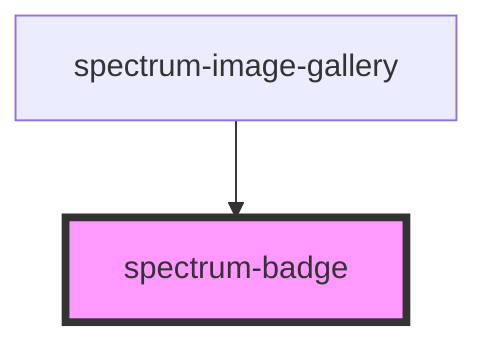

# spectrum-badge

<!-- Auto Generated Below -->

## Properties

| Property   | Attribute  | Description                                                        | Type                                                             | Default     |
| ---------- | ---------- | ------------------------------------------------------------------ | ---------------------------------------------------------------- | ----------- |
| `circular` | `circular` | Whether the badge should be circular (for single characters/icons) | `boolean`                                                        | `false`     |
| `debug`    | `debug`    | Whether to enable debug logging                                    | `boolean`                                                        | `false`     |
| `size`     | `size`     | The size of the badge                                              | `"large" \| "medium" \| "small"`                                 | `'medium'`  |
| `text`     | `text`     | The text content of the badge                                      | `string`                                                         | `''`        |
| `variant`  | `variant`  | The variant/color of the badge                                     | `"danger" \| "primary" \| "secondary" \| "success" \| "warning"` | `'primary'` |

## Dependencies

### Used by

 - [spectrum-image-gallery](../spectrum-image-gallery)

### Graph

----------------------------------------------

