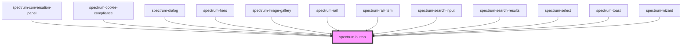

# spectrum-button

## Size Options

The button component supports the following size options:

- `sm` or `small` - Small size button  
- `medium` or `base` - Medium size button (recommended for new implementations)
- `lg` or `large` - Large size button

**Size Aliases:**
- `small` → maps to `sm` (user-friendly alias)
- `large` → maps to `lg` (user-friendly alias)  
- `medium` → maps to `base` (recommended alias)
- `base` → legacy medium size (maintained for backward compatibility)

**Note:** The friendly aliases (`small`, `medium`, `large`) are recommended for new implementations as they are more intuitive. The short forms (`sm`, `base`, `lg`) are maintained for backward compatibility with existing implementations.

<!-- Auto Generated Below -->

## Overview

Spectrum Button Component
A versatile button component with multiple variants, sizes, and states.
Supports icons, text, and various interactive states.

## Properties

| Property           | Attribute           | Description | Type                                                                                              | Default     |
| ------------------ | ------------------- | ----------- | ------------------------------------------------------------------------------------------------- | ----------- |
| `action`           | `action`            |             | `string`                                                                                          | `''`        |
| `buttonText`       | `button-text`       |             | `string`                                                                                          | `''`        |
| `customStyle`      | `custom-style`      |             | `{ [key: string]: string; }`                                                                      | `{}`        |
| `debug`            | `debug`             |             | `boolean`                                                                                         | `false`     |
| `disabled`         | `disabled`          |             | `boolean`                                                                                         | `false`     |
| `haptic`           | `haptic`            |             | `boolean`                                                                                         | `false`     |
| `href`             | `href`              |             | `string`                                                                                          | `undefined` |
| `iconOnly`         | `icon-only`         |             | `boolean`                                                                                         | `false`     |
| `leftIcon`         | `left-icon`         |             | `string`                                                                                          | `''`        |
| `minimalAnimation` | `minimal-animation` |             | `boolean`                                                                                         | `false`     |
| `outline`          | `outline`           |             | `boolean`                                                                                         | `false`     |
| `rel`              | `rel`               |             | `string`                                                                                          | `undefined` |
| `rightIcon`        | `right-icon`        |             | `string`                                                                                          | `''`        |
| `ripple`           | `ripple`            |             | `boolean`                                                                                         | `false`     |
| `showButtonText`   | `show-button-text`  |             | `boolean`                                                                                         | `true`      |
| `showLeftIcon`     | `show-left-icon`    |             | `boolean`                                                                                         | `false`     |
| `showRightIcon`    | `show-right-icon`   |             | `boolean`                                                                                         | `false`     |
| `size`             | `size`              |             | `"base" \| "large" \| "lg" \| "medium" \| "sm" \| "small"`                                        | `'base'`    |
| `sound`            | `sound`             |             | `boolean`                                                                                         | `false`     |
| `state`            | `state`             |             | `"active" \| "default" \| "disabled" \| "hover"`                                                  | `'default'` |
| `target`           | `target`            |             | `string`                                                                                          | `undefined` |
| `variant`          | `variant`           |             | `"danger" \| "fab" \| "ghost" \| "outline" \| "primary" \| "secondary" \| "success" \| "warning"` | `'primary'` |

## Events

| Event          | Description | Type                                               |
| -------------- | ----------- | -------------------------------------------------- |
| `buttonAction` |             | `CustomEvent<{ action?: string; label: string; }>` |

## Dependencies

### Used by

 - [spectrum-conversation-panel](../spectrum-conversation-panel)
 - [spectrum-cookie-compliance](../spectrum-cookie-compliance)
 - [spectrum-dialog](../spectrum-dialog)
 - [spectrum-hero](../spectrum-hero)
 - [spectrum-image-gallery](../spectrum-image-gallery)
 - [spectrum-rail](../spectrum-rail)
 - [spectrum-rail-item](../spectrum-rail-item)
 - [spectrum-search-input](../spectrum-search-input)
 - [spectrum-search-results](../spectrum-search-results)
 - [spectrum-select](../spectrum-select)
 - [spectrum-toast](../spectrum-toast)
 - [spectrum-wizard](../spectrum-wizard)

### Graph

----------------------------------------------

