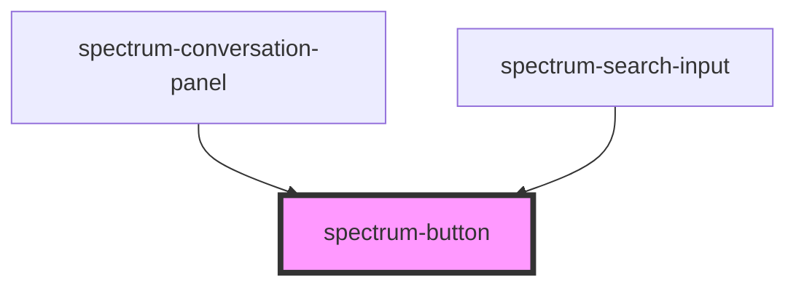

# spectrum-button

<!-- Auto Generated Below -->

## Properties

| Property         | Attribute          | Description | Type                                                                        | Default     |
| ---------------- | ------------------ | ----------- | --------------------------------------------------------------------------- | ----------- |
| `buttonText`     | `button-text`      |             | `string`                                                                    | `''`        |
| `iconOnly`       | `icon-only`        |             | `boolean`                                                                   | `false`     |
| `leftIcon`       | `left-icon`        |             | `string`                                                                    | `''`        |
| `outline`        | `outline`          |             | `boolean`                                                                   | `false`     |
| `rightIcon`      | `right-icon`       |             | `string`                                                                    | `''`        |
| `showButtonText` | `show-button-text` |             | `boolean`                                                                   | `true`      |
| `showLeftIcon`   | `show-left-icon`   |             | `boolean`                                                                   | `false`     |
| `showRightIcon`  | `show-right-icon`  |             | `boolean`                                                                   | `false`     |
| `size`           | `size`             |             | `"base" \| "lg" \| "sm"`                                                    | `'base'`    |
| `state`          | `state`            |             | `"active" \| "default" \| "disabled" \| "hover"`                            | `'default'` |
| `variant`        | `variant`          |             | `"danger" \| "ghost" \| "primary" \| "secondary" \| "success" \| "warning"` | `'primary'` |

## Dependencies

### Used by

 - [spectrum-conversation-panel](../spectrum-conversation-panel)
 - [spectrum-search-input](../spectrum-search-input)

### Graph

----------------------------------------------

