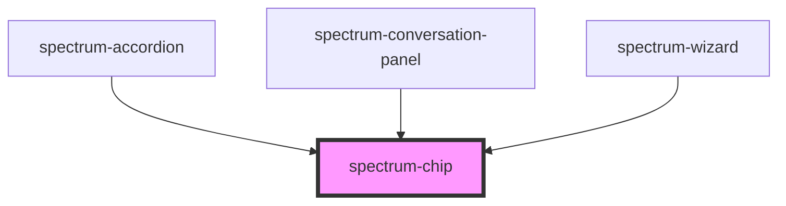

# spectrum-chip

<!-- Auto Generated Below -->

## Overview

Spectrum Chip Component
A versatile chip component that can be used for tags, filters, and selections.
Supports leading/trailing icons, selection states, and various interactive behaviors.

## Properties

| Property           | Attribute            | Description | Type                                                                          | Default     |
| ------------------ | -------------------- | ----------- | ----------------------------------------------------------------------------- | ----------- |
| `action`           | `action`             |             | `string`                                                                      | `''`        |
| `debug`            | `debug`              |             | `boolean`                                                                     | `false`     |
| `disabled`         | `disabled`           |             | `boolean`                                                                     | `false`     |
| `haptic`           | `haptic`             |             | `boolean`                                                                     | `false`     |
| `label`            | `label`              |             | `string`                                                                      | `''`        |
| `leadingIcon`      | `leading-icon`       |             | `string`                                                                      | `''`        |
| `outline`          | `outline`            |             | `boolean`                                                                     | `false`     |
| `ripple`           | `ripple`             |             | `boolean`                                                                     | `false`     |
| `selected`         | `selected`           |             | `boolean`                                                                     | `false`     |
| `showTrailingIcon` | `show-trailing-icon` |             | `boolean`                                                                     | `false`     |
| `size`             | `size`               |             | `"extra-small" \| "large" \| "medium" \| "small"`                             | `'medium'`  |
| `sound`            | `sound`              |             | `boolean`                                                                     | `false`     |
| `trailingIcon`     | `trailing-icon`      |             | `string`                                                                      | `'close'`   |
| `variant`          | `variant`            |             | `"assist" \| "filter" \| "input" \| "primary" \| "secondary" \| "suggestion"` | `'primary'` |

## Events

| Event        | Description | Type                                               |
| ------------ | ----------- | -------------------------------------------------- |
| `chipAction` |             | `CustomEvent<{ action?: string; label: string; }>` |

## Dependencies

### Used by

 - [spectrum-accordion](../spectrum-accordion)
 - [spectrum-conversation-panel](../spectrum-conversation-panel)
 - [spectrum-wizard](../spectrum-wizard)

### Graph

----------------------------------------------

