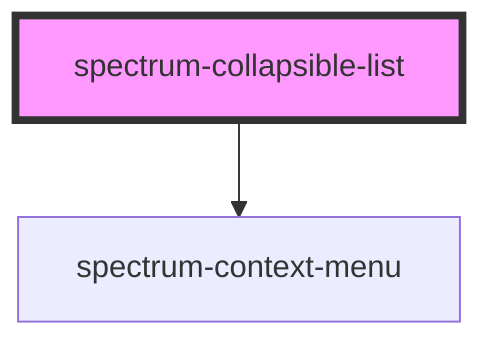

# spectrum-collapsible-list

<!-- Auto Generated Below -->

## Properties

| Property            | Attribute            | Description                                                                                                                    | Type                    | Default |
| ------------------- | -------------------- | ------------------------------------------------------------------------------------------------------------------------------ | ----------------------- | ------- |
| `contextActions`    | --                   | Context actions for all leaf nodes                                                                                             | `ContextMenuAction[]`   | `[]`    |
| `filter`            | `filter`             | Filter value to filter list items                                                                                              | `string`                | `''`    |
| `items`             | --                   | The nested data structure for the list                                                                                         | `CollapsibleListItem[]` | `[]`    |
| `mutuallyExclusive` | `mutually-exclusive` | Controls whether expanding one parent collapses other parents at the same level Default is true (mutually exclusive expansion) | `boolean`               | `true`  |

## Events

| Event            | Description                                    | Type                                                                             |
| ---------------- | ---------------------------------------------- | -------------------------------------------------------------------------------- |
| `childAction`    | Event emitted when a child node is clicked     | `CustomEvent<{ action: string; label: string; id: string; }>`                    |
| `contextAction`  | Event emitted when a context action is clicked | `CustomEvent<{ action: string; label: string; id: string; }>`                    |
| `contractAction` | Event emitted when a parent node is contracted | `CustomEvent<{ action: string; label: string; id: string; }>`                    |
| `expandAction`   | Event emitted when a parent node is expanded   | `CustomEvent<{ action: string; label: string; id: string; }>`                    |
| `itemRenamed`    | Event emitted when an item is renamed          | `CustomEvent<{ action: string; id: string; oldName: string; newName: string; }>` |

## Dependencies

### Depends on

- [spectrum-context-menu](../spectrum-context-menu)

### Graph

----------------------------------------------

