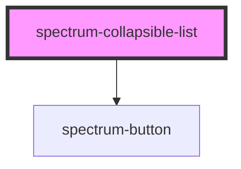

# spectrum-collapsible-list

<!-- Auto Generated Below -->

## Properties

| Property         | Attribute | Description                            | Type                                                | Default |
| ---------------- | --------- | -------------------------------------- | --------------------------------------------------- | ------- |
| `contextActions` | --        | Context actions for all leaf nodes     | `{ label: string; icon: string; value: string; }[]` | `[]`    |
| `items`          | --        | The nested data structure for the list | `CollapsibleListItem[]`                             | `[]`    |

## Events

| Event             | Description                                    | Type                                              |
| ----------------- | ---------------------------------------------- | ------------------------------------------------- |
| `child-action`    | Event emitted when a child node is clicked     | `CustomEvent<{ action: string; label: string; }>` |
| `context-action`  | Event emitted when a context action is clicked | `CustomEvent<{ value: string; label: string; }>`  |
| `contract-action` | Event emitted when a parent node is contracted | `CustomEvent<{ label: string; }>`                 |
| `expand-action`   | Event emitted when a parent node is expanded   | `CustomEvent<{ label: string; }>`                 |

## Dependencies

### Depends on

- [spectrum-button](../spectrum-button)

### Graph

----------------------------------------------

