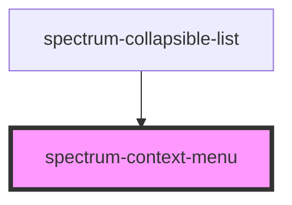

# spectrum-context-menu

<!-- Auto Generated Below -->

## Overview

Spectrum Context Menu Component
A popup menu for contextual actions that can be attached to any element.

## Properties

| Property   | Attribute  | Description                                                       | Type                                     | Default   |
| ---------- | ---------- | ----------------------------------------------------------------- | ---------------------------------------- | --------- |
| `position` | `position` | The key identifying the target component that triggered this menu | `"bottom" \| "left" \| "right" \| "top"` | `'right'` |

## Events

| Event          | Description                             | Type                                                 |
| -------------- | --------------------------------------- | ---------------------------------------------------- |
| `action-click` | Event emitted when an action is clicked | `CustomEvent<{ value: string; targetKey: string; }>` |
| `menu-close`   | Event emitted when the menu is closed   | `CustomEvent<void>`                                  |

## Methods

### `hide() => Promise<void>`

#### Returns

Type: `Promise<void>`

### `positionAtCoordinates(x: number, y: number) => Promise<boolean>`

Position the menu at specific coordinates

#### Parameters

| Name | Type     | Description |
| ---- | -------- | ----------- |
| `x`  | `number` |             |
| `y`  | `number` |             |

#### Returns

Type: `Promise<boolean>`

### `show(actions: any[], x: number, y: number, targetKey: string) => Promise<void>`

#### Parameters

| Name        | Type     | Description |
| ----------- | -------- | ----------- |
| `actions`   | `any[]`  |             |
| `x`         | `number` |             |
| `y`         | `number` |             |
| `targetKey` | `string` |             |

#### Returns

Type: `Promise<void>`

## Dependencies

### Used by

 - [spectrum-collapsible-list](../spectrum-collapsible-list)

### Graph

----------------------------------------------

