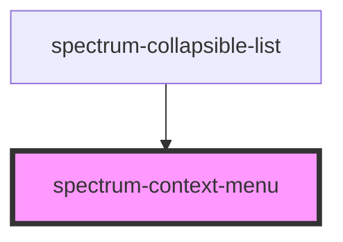

# spectrum-context-menu

<!-- Auto Generated Below -->

## Overview

Spectrum Context Menu Component
A popup menu for contextual actions that can be attached to any element.

## Properties

| Property    | Attribute    | Description                                                       | Type                                     | Default   |
| ----------- | ------------ | ----------------------------------------------------------------- | ---------------------------------------- | --------- |
| `actions`   | --           | Array of action objects to display in the menu                    | `ContextMenuAction[]`                    | `[]`      |
| `isOpen`    | `is-open`    | Whether the menu is currently open                                | `boolean`                                | `false`   |
| `position`  | `position`   | Position of the menu relative to the trigger element              | `"bottom" \| "left" \| "right" \| "top"` | `'right'` |
| `targetKey` | `target-key` | The key identifying the target component that triggered this menu | `string`                                 | `''`      |

## Events

| Event          | Description                             | Type                                                 |
| -------------- | --------------------------------------- | ---------------------------------------------------- |
| `action-click` | Event emitted when an action is clicked | `CustomEvent<{ value: string; targetKey: string; }>` |
| `menu-close`   | Event emitted when the menu is closed   | `CustomEvent<void>`                                  |

## Methods

### `close() => Promise<boolean>`

Close the menu

#### Returns

Type: `Promise<boolean>`

### `open() => Promise<boolean>`

Open the menu

#### Returns

Type: `Promise<boolean>`

### `positionAtCoordinates(x: number, y: number) => Promise<boolean>`

Position the menu at specific coordinates

#### Parameters

| Name | Type     | Description |
| ---- | -------- | ----------- |
| `x`  | `number` |             |
| `y`  | `number` |             |

#### Returns

Type: `Promise<boolean>`

### `setTriggerRef(element: HTMLElement) => Promise<boolean>`

Set the trigger element reference

#### Parameters

| Name      | Type          | Description |
| --------- | ------------- | ----------- |
| `element` | `HTMLElement` |             |

#### Returns

Type: `Promise<boolean>`

## Dependencies

### Used by

 - [spectrum-collapsible-list](../spectrum-collapsible-list)

### Graph

----------------------------------------------

