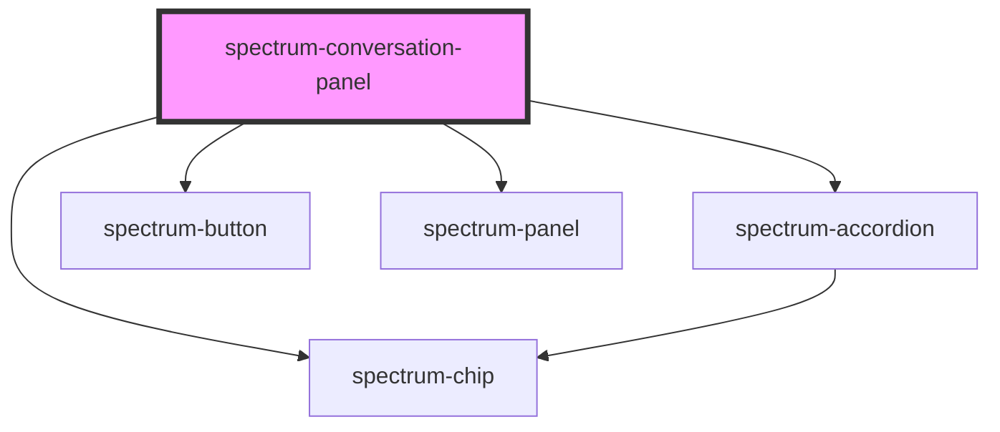

# spectrum-conversation-panel

<!-- Auto Generated Below -->

## Properties

| Property            | Attribute           | Description                                                      | Type                                                           | Default               |
| ------------------- | ------------------- | ---------------------------------------------------------------- | -------------------------------------------------------------- | --------------------- |
| `actions`           | `actions`           | The actions to display in the messages Default: null             | `string`                                                       | `''`                  |
| `background`        | `background`        | Background level for the panel                                   | `"full-frost" \| "opaque" \| "partial-frost" \| "transparent"` | `'opaque'`            |
| `conversationtitle` | `conversationtitle` | The title to display in the conversation panel Default: null     | `string`                                                       | `'No title provided'` |
| `debug`             | `debug`             | Whether to enable debug logging                                  | `boolean`                                                      | `false`               |
| `loading`           | `loading`           | Whether to show the loading indicator Default: false             | `boolean`                                                      | `false`               |
| `messages`          | `messages`          | The messages to display in the conversation panel as JSON string | `string`                                                       | `''`                  |
| `sound`             | `sound`             | Whether to enable sound effects Default: false                   | `boolean`                                                      | `false`               |
| `sources`           | `sources`           | The sources to display in the messages Default: null             | `string`                                                       | `''`                  |

## Events

| Event                 | Description | Type                                                                                 |
| --------------------- | ----------- | ------------------------------------------------------------------------------------ |
| `action`              |             | `CustomEvent<{ action: string; type: string; value: string; messageId?: string; }>`  |
| `explorationSelected` |             | `CustomEvent<{ action: string; exploration: string; }>`                              |
| `explore`             |             | `CustomEvent<{ action: string; value: string; }>`                                    |
| `sourceClick`         |             | `CustomEvent<{ action: string; label: string; value: string; messageId?: string; }>` |
| `titleChanged`        |             | `CustomEvent<{ action: string; value: string; }>`                                    |

## Methods

### `scrollToLatest() => Promise<void>`

Scrolls the conversation panel to the latest message

#### Returns

Type: `Promise<void>`

## Dependencies

### Depends on

- [spectrum-accordion](../spectrum-accordion)
- [spectrum-button](../spectrum-button)
- [spectrum-chip](../spectrum-chip)
- [spectrum-panel](../spectrum-panel)

### Graph

----------------------------------------------

