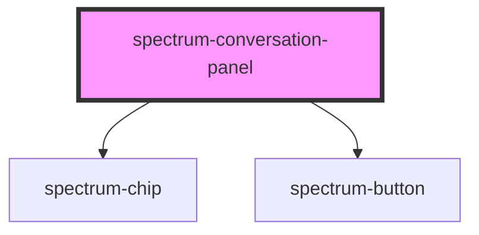

# spectrum-conversation-panel

<!-- Auto Generated Below -->

## Properties

| Property            | Attribute           | Description                                                      | Type     | Default               |
| ------------------- | ------------------- | ---------------------------------------------------------------- | -------- | --------------------- |
| `actions`           | `actions`           | The actions to display in the messages Default: null             | `string` | `''`                  |
| `conversationtitle` | `conversationtitle` | The title to display in the conversation panel Default: null     | `string` | `'No title provided'` |
| `messages`          | `messages`          | The messsages to display in the conversation panel Default: null | `string` | `''`                  |
| `sources`           | `sources`           | The sources to display in the messages Default: null             | `string` | `''`                  |

## Events

| Event                 | Description | Type                                             |
| --------------------- | ----------- | ------------------------------------------------ |
| `action`              |             | `CustomEvent<{ type: string; value: string; }>`  |
| `explorationSelected` |             | `CustomEvent<string>`                            |
| `explore`             |             | `CustomEvent<string>`                            |
| `sourceClick`         |             | `CustomEvent<{ label: string; value: string; }>` |

## Methods

### `scrollToLatest() => Promise<void>`

Scrolls the conversation panel to the latest message

#### Returns

Type: `Promise<void>`

## Dependencies

### Depends on

- [spectrum-chip](../spectrum-chip)
- [spectrum-button](../spectrum-button)

### Graph

----------------------------------------------

