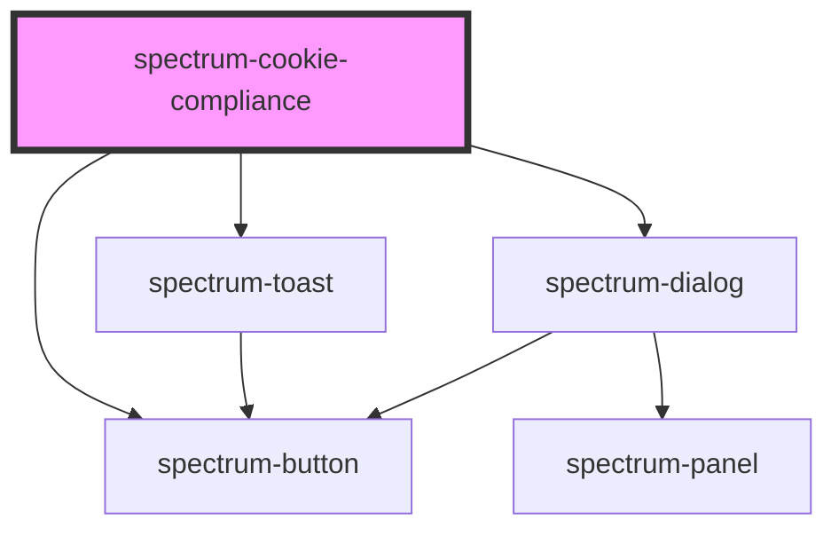

# spectrum-cookie-compliance

<!-- Auto Generated Below -->

## Properties

| Property           | Attribute             | Description                                                                                                                                        | Type                            | Default                                                                                                                                                    |
| ------------------ | --------------------- | -------------------------------------------------------------------------------------------------------------------------------------------------- | ------------------------------- | ---------------------------------------------------------------------------------------------------------------------------------------------------------- |
| `autoLoadGTM`      | `auto-load-g-t-m`     | Automatically load GTM script when consent is granted                                                                                              | `boolean`                       | `false`                                                                                                                                                    |
| `consentVersion`   | `consent-version`     | Consent version for tracking updates                                                                                                               | `string`                        | `'1.0.0'`                                                                                                                                                  |
| `cookieExpireDays` | `cookie-expire-days`  | Number of days before cookie expires                                                                                                               | `number`                        | `365`                                                                                                                                                      |
| `cookieName`       | `cookie-name`         | Cookie name for storing consent preferences                                                                                                        | `string`                        | `'spectrum_cookie_consent'`                                                                                                                                |
| `cookiePolicyUrl`  | `cookie-policy-url`   | URL to cookie policy page                                                                                                                          | `string`                        | `'/cookie-policy'`                                                                                                                                         |
| `debug`            | `debug`               | Whether to enable debug logging                                                                                                                    | `boolean`                       | `false`                                                                                                                                                    |
| `gtmContainerId`   | `gtm-container-id`    | Google Tag Manager container ID                                                                                                                    | `string`                        | `''`                                                                                                                                                       |
| `message`          | `message`             | Custom message to display in the consent banner                                                                                                    | `string`                        | `'We use cookies to enhance your experience, analyze site traffic, and personalize content. By clicking "Accept All", you consent to our use of cookies.'` |
| `position`         | `position`            | Position of the consent banner                                                                                                                     | `"bottom" \| "center" \| "top"` | `'bottom'`                                                                                                                                                 |
| `privacyPolicyUrl` | `privacy-policy-url`  | URL to privacy policy page                                                                                                                         | `string`                        | `'/privacy-policy'`                                                                                                                                        |
| `showCookieStatus` | `show-cookie-status`  | Whether to show the cookie status indicator (sticky icon)                                                                                          | `boolean`                       | `false`                                                                                                                                                    |
| `showDetails`      | `show-details`        | Whether to show detailed cookie options                                                                                                            | `boolean`                       | `false`                                                                                                                                                    |
| `showOnFirstVisit` | `show-on-first-visit` | Whether to show the banner on first visit                                                                                                          | `boolean`                       | `true`                                                                                                                                                     |
| `translations`     | `translations`        | Translation object for customizing all user-facing text. Provide only the strings you want to override - missing values will use English defaults. | `CookieTranslations`            | `{}`                                                                                                                                                       |

## Events

| Event              | Description                                    | Type                         |
| ------------------ | ---------------------------------------------- | ---------------------------- |
| `consentDismissed` | Event emitted when consent banner is dismissed | `CustomEvent<void>`          |
| `consentUpdated`   | Event emitted when consent is given or updated | `CustomEvent<CookieConsent>` |

## Methods

### `getStoredConsent() => Promise<CookieConsent | null>`

Get stored consent from cookies

#### Returns

Type: `Promise<CookieConsent>`

### `hideConsent() => Promise<void>`

Hide the consent banner

#### Returns

Type: `Promise<void>`

### `resetConsent() => Promise<void>`

Reset all consent preferences

#### Returns

Type: `Promise<void>`

### `showConsent() => Promise<void>`

Show the consent banner

#### Returns

Type: `Promise<void>`

### `updateConsent(consent: Partial<CookieConsent>) => Promise<void>`

Update consent preferences

#### Parameters

| Name      | Type                                                                                                                              | Description |
| --------- | --------------------------------------------------------------------------------------------------------------------------------- | ----------- |
| `consent` | `{ necessary?: boolean; analytics?: boolean; marketing?: boolean; preferences?: boolean; timestamp?: number; version?: string; }` |             |

#### Returns

Type: `Promise<void>`

## Dependencies

### Depends on

- [spectrum-button](../spectrum-button)
- [spectrum-toast](../spectrum-toast)
- [spectrum-dialog](../spectrum-dialog)

### Graph

----------------------------------------------

