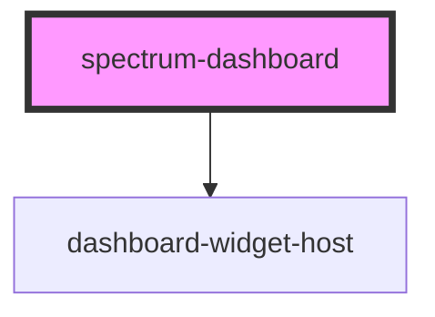

# spectrum-dashboard

A flexible dashboard container component for organizing and displaying dashboard content.

## Usage

```html
<spectrum-dashboard>
  <!-- Dashboard content goes here -->
</spectrum-dashboard>
```

<!-- Auto Generated Below -->


## Properties

| Property              | Attribute | Description                                                                                                                                                | Type                                                    | Default     |
| --------------------- | --------- | ---------------------------------------------------------------------------------------------------------------------------------------------------------- | ------------------------------------------------------- | ----------- |
| `config` _(required)_ | `config`  | Dashboard configuration (JSON-driven) Can be a JSON string or object Supports both single-view (DashboardConfig) and multi-view (MultiViewDashboardConfig) | `DashboardConfig \| MultiViewDashboardConfig \| string` | `undefined` |
| `context`             | `context` | Global context for all widgets (userId, authToken, etc.)                                                                                                   | `{ [x: string]: any; }`                                 | `{}`        |
| `debug`               | `debug`   | Whether to enable debug logging                                                                                                                            | `boolean`                                               | `false`     |


## Events

| Event          | Description                                           | Type                             |
| -------------- | ----------------------------------------------------- | -------------------------------- |
| `dashboardNav` | Event emitted when navigation/drill-down is requested | `CustomEvent<DashboardNavEvent>` |
| `dataRefresh`  | Event emitted when data refresh is requested          | `CustomEvent<DataRefreshEvent>`  |


## Dependencies

### Depends on

- [dashboard-widget-host](../dashboard-widget-host)

### Graph


----------------------------------------------


