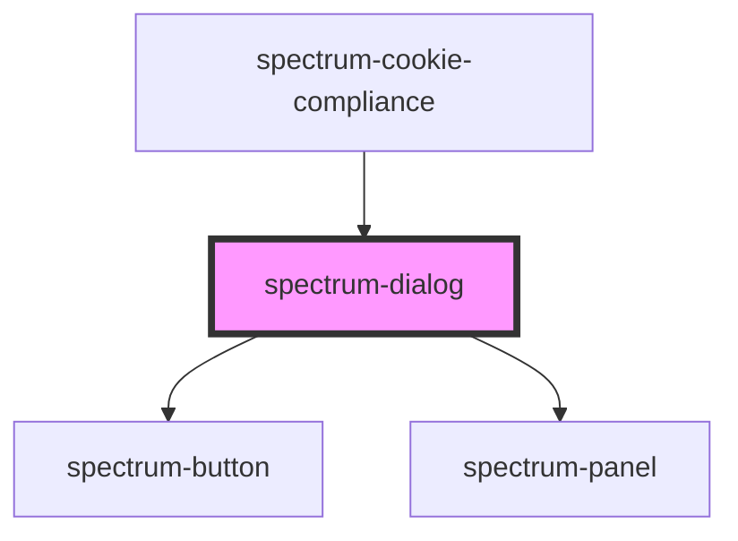

# spectrum-dialog

<!-- Auto Generated Below -->

## Overview

Spectrum Dialog Component
A modal dialog component using the HTML dialog element with background shade.
Features close functionality, optional title, control bar, and uses spectrum-panel for styling.

## Properties

| Property              | Attribute                | Description                                         | Type                                                           | Default     |
| --------------------- | ------------------------ | --------------------------------------------------- | -------------------------------------------------------------- | ----------- |
| `background`          | `background`             | Background level for the dialog panel               | `"full-frost" \| "opaque" \| "partial-frost" \| "transparent"` | `'opaque'`  |
| `buttons`             | `buttons`                | Array of buttons for the control bar                | `DialogButton[]`                                               | `[]`        |
| `closeOnEscape`       | `close-on-escape`        | Whether pressing Escape should close the dialog     | `boolean`                                                      | `true`      |
| `closeOnOutsideClick` | `close-on-outside-click` | Whether clicking outside the dialog should close it | `boolean`                                                      | `true`      |
| `debug`               | `debug`                  | Whether to enable debug logging                     | `boolean`                                                      | `false`     |
| `dialogId`            | `dialog-id`              | Optional dialog identifier for event handling       | `string`                                                       | `undefined` |
| `dialogTitle`         | `dialog-title`           | Optional title for the dialog                       | `string`                                                       | `undefined` |
| `height`              | `height`                 | Custom height for the dialog                        | `string`                                                       | `undefined` |
| `noPadding`           | `no-padding`             | Whether to remove padding from the content area     | `boolean`                                                      | `false`     |
| `open`                | `open`                   | Whether the dialog is open                          | `boolean`                                                      | `false`     |
| `showCloseButton`     | `show-close-button`      | Whether to show the close button                    | `boolean`                                                      | `true`      |
| `size`                | `size`                   | Size of the dialog                                  | `"auto" \| "full" \| "large" \| "medium" \| "small"`           | `'medium'`  |
| `width`               | `width`                  | Custom width for the dialog                         | `string`                                                       | `undefined` |

## Events

| Event          | Description                             | Type                                                                     |
| -------------- | --------------------------------------- | ------------------------------------------------------------------------ |
| `dialogAction` | Event emitted when dialog actions occur | `CustomEvent<{ action: string; dialogId?: string; buttonId?: string; }>` |
| `dialogClose`  | Event emitted when dialog is closed     | `CustomEvent<{ action: string; dialogId?: string; }>`                    |

## Methods

### `hide() => Promise<void>`

Hide the dialog

#### Returns

Type: `Promise<void>`

### `show() => Promise<void>`

Show the dialog

#### Returns

Type: `Promise<void>`

### `toggle() => Promise<void>`

Toggle dialog visibility

#### Returns

Type: `Promise<void>`

## Dependencies

### Used by

 - [spectrum-cookie-compliance](../spectrum-cookie-compliance)

### Depends on

- [spectrum-button](../spectrum-button)
- [spectrum-panel](../spectrum-panel)

### Graph

----------------------------------------------

