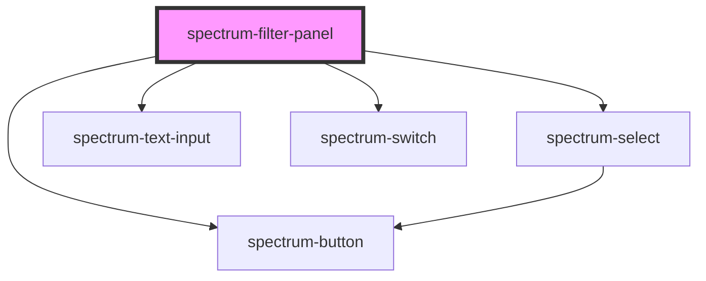

# spectrum-filter-panel

<!-- Auto Generated Below -->

## Properties

| Property      | Attribute      | Description                                             | Type                           | Default        |
| ------------- | -------------- | ------------------------------------------------------- | ------------------------------ | -------------- |
| `context`     | `context`      | Dashboard context (optional)                            | `{ [x: string]: any; }`        | `{}`           |
| `debug`       | `debug`        | Debug mode                                              | `boolean`                      | `false`        |
| `filters`     | `filters`      | Filter definitions (can be JSON string or object array) | `FilterDefinition[] \| string` | `[]`           |
| `immediate`   | `immediate`    | Whether to apply filters immediately on change          | `boolean`                      | `false`        |
| `layout`      | `layout`       | Layout orientation                                      | `"horizontal" \| "vertical"`   | `'horizontal'` |
| `showButtons` | `show-buttons` | Whether to show apply/reset buttons                     | `boolean`                      | `true`         |

## Events

| Event          | Description                      | Type                                 |
| -------------- | -------------------------------- | ------------------------------------ |
| `filterApply`  | Emitted when filters are applied | `CustomEvent<{ [x: string]: any; }>` |
| `filterChange` | Emitted when filters change      | `CustomEvent<{ [x: string]: any; }>` |
| `filterReset`  | Emitted when filters are reset   | `CustomEvent<void>`                  |

## Slots

| Slot | Description                            |
| ---- | -------------------------------------- |
|      | Default slot for custom filter content |

## Dependencies

### Depends on

- [spectrum-select](../spectrum-select)
- [spectrum-text-input](../spectrum-text-input)
- [spectrum-switch](../spectrum-switch)
- [spectrum-button](../spectrum-button)

### Graph

----------------------------------------------

