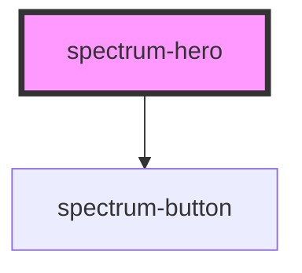

# spectrum-hero

<!-- Auto Generated Below -->

## Overview

Spectrum Hero Component
A hero section component that supports both images and video backgrounds,
with carousel functionality, text overlays, and call-to-action buttons.

## Properties

| Property             | Attribute             | Description                                                                             | Type      | Default   |
| -------------------- | --------------------- | --------------------------------------------------------------------------------------- | --------- | --------- |
| `animationDuration`  | `animation-duration`  | Animation duration for slide transitions                                                | `number`  | `1000`    |
| `autoplay`           | `autoplay`            | Enable carousel autoplay Time in milliseconds between slides (0 to disable)             | `number`  | `0`       |
| `debug`              | `debug`               | Debug mode                                                                              | `boolean` | `false`   |
| `height`             | `height`              | Hero height (CSS value)                                                                 | `string`  | `'100vh'` |
| `keyboardNavigation` | `keyboard-navigation` | Enable keyboard navigation                                                              | `boolean` | `true`    |
| `pauseOnHover`       | `pause-on-hover`      | Pause autoplay on hover                                                                 | `boolean` | `true`    |
| `showArrows`         | `show-arrows`         | Show navigation arrows                                                                  | `boolean` | `true`    |
| `showDots`           | `show-dots`           | Show navigation dots                                                                    | `boolean` | `true`    |
| `slides`             | `slides`              | Hero slides as JSON string Array of HeroSlide objects containing content for each slide | `string`  | `'[]'`    |

## Events

| Event         | Description                                        | Type                                                                        |
| ------------- | -------------------------------------------------- | --------------------------------------------------------------------------- |
| `heroAction`  | Event emitted when a hero action button is clicked | `CustomEvent<{ action: string; slideIndex: number; slideTitle?: string; }>` |
| `slideChange` | Event emitted when slide changes                   | `CustomEvent<{ action: string; slideIndex: number; totalSlides: number; }>` |

## Dependencies

### Depends on

- [spectrum-button](../spectrum-button)

### Graph

----------------------------------------------

