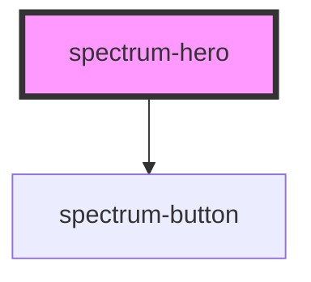

# spectrum-hero

<!-- Auto Generated Below -->

## Overview

Spectrum Hero Component
A hero section component that supports both images and video backgrounds,
with carousel functionality, text overlays, and call-to-action buttons.

Features:
- Responsive image support through srcset and sizes attributes for optimal delivery
- Direct navigation support for call-to-action buttons via href, target, and rel attributes
- Event-based interactions for custom handling alongside direct navigation
- Accessibility support with keyboard navigation and screen reader compatibility

## Properties

| Property             | Attribute             | Description                                                                             | Type      | Default   |
| -------------------- | --------------------- | --------------------------------------------------------------------------------------- | --------- | --------- |
| `animationDuration`  | `animation-duration`  | Animation duration for slide transitions                                                | `number`  | `1000`    |
| `autoplay`           | `autoplay`            | Enable carousel autoplay Time in milliseconds between slides (0 to disable)             | `number`  | `0`       |
| `carouselMode`       | `carousel-mode`       | Enable carousel mode with bottom subtitle display and image navigation                  | `boolean` | `false`   |
| `debug`              | `debug`               | Debug mode                                                                              | `boolean` | `false`   |
| `height`             | `height`              | Hero height (CSS value)                                                                 | `string`  | `'100vh'` |
| `keyboardNavigation` | `keyboard-navigation` | Enable keyboard navigation                                                              | `boolean` | `true`    |
| `overlayStyle`       | `overlay-style`       | Custom CSS styles for the overlay container (CSS style string)                          | `string`  | `''`      |
| `pauseOnHover`       | `pause-on-hover`      | Pause autoplay on hover                                                                 | `boolean` | `true`    |
| `rounded`            | `rounded`             | Enable rounded corners using Spectrum design tokens                                     | `boolean` | `false`   |
| `shaded`             | `shaded`              | Add gradient shade overlay between media and content                                    | `boolean` | `true`    |
| `showArrows`         | `show-arrows`         | Show navigation arrows                                                                  | `boolean` | `true`    |
| `showDots`           | `show-dots`           | Show navigation dots                                                                    | `boolean` | `true`    |
| `slides`             | `slides`              | Hero slides as JSON string Array of HeroSlide objects containing content for each slide | `string`  | `'[]'`    |

## Events

| Event             | Description                                             | Type                                                                                                                            |
| ----------------- | ------------------------------------------------------- | ------------------------------------------------------------------------------------------------------------------------------- |
| `heroAction`      | Event emitted when a hero action button is clicked      | `CustomEvent<{ action: string; slideIndex: number; slideTitle?: string; navigationType: "event" \| "direct"; href?: string; }>` |
| `imageNavigation` | Event emitted when an image is clicked in carousel mode | `CustomEvent<{ action: string; slideIndex: number; direction: "next" \| "previous"; }>`                                         |
| `slideChange`     | Event emitted when slide changes                        | `CustomEvent<{ action: string; slideIndex: number; totalSlides: number; }>`                                                     |

## Dependencies

### Depends on

- [spectrum-button](../spectrum-button)

### Graph

----------------------------------------------

