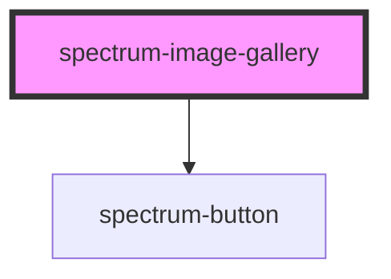

# spectrum-image-gallery

A beautiful, responsive image gallery component with masonry and horizontal layouts. Features modal-based image upload, URL input, selection capabilities, and delete functionality.

## Features

- **Masonry Layout**: Pinterest-style vertical masonry using CSS columns
- **Horizontal Scrolling**: Linear horizontal layout for carousels and strips  
- **File Upload**: Modal-based drag & drop and file browser upload
- **URL Input**: Add images from external URLs with validation
- **Selection Modes**: Single select, multi-select, or no selection
- **Delete Functionality**: Remove selected images
- **Preview Mode**: Enlarged image preview with modal overlay
- **Event System**: Rich events with complete image data
- **Responsive Design**: Adapts seamlessly to different screen sizes
- **Accessibility**: Full keyboard navigation and screen reader support
- **Spectrum Theming**: Consistent with Spectrum design patterns

## Preview Mode

When `previewMode` is enabled:
- **No Upload/Delete**: Upload, URL input, and delete controls are hidden
- **Preview on Click**: Clicking images opens an enlarged preview modal
- **Animated Modal**: Smooth fade-in and zoom animations
- **Overlay Close**: Click outside image or close button to dismiss
- **Responsive**: Adapts to different screen sizes with proper scaling
- **Accessibility**: Full keyboard navigation and proper ARIA labels

## Upload Functionality

When users upload files:
1. **File Processing**: Files are converted to base64 data URLs using `FileReader`
2. **Immediate Display**: Images appear instantly in the gallery (no server required)
3. **Rich Metadata**: Preserves filename, size, type, and upload timestamp
4. **Event Emission**: Complete image data is emitted via `imageAdded` event
5. **Temporary Storage**: Images exist only in component state (lost on page refresh)

## Event System

### imagePreview Event
Emitted when an image is clicked in preview mode:
```typescript
{
  id: string;           // Unique image ID
  url: string;          // Image URL
  alt?: string;         // Alt text
  title?: string;       // Display title
  metadata?: Record<string, any>; // Additional metadata
}
```

### imageAdded Event
Emitted when images are uploaded or added via URL:
```typescript
{
  image: {
    id: string;           // Unique generated ID
    url: string;          // Base64 data URL or external URL
    alt: string;          // Filename or description
    title: string;        // Display title
    metadata: {
      fileName?: string;  // Original filename (uploads only)
      fileSize?: number;  // File size in bytes (uploads only)
      fileType?: string;  // MIME type (uploads only)
      uploadDate?: string; // ISO timestamp (uploads only)
      source: 'upload' | 'url';
    }
  },
  source: 'upload' | 'url'
}
```

### imageDeleted Event
Emitted when selected images are deleted:
```typescript
{
  deletedImages: ImageConfig[];  // Array of deleted image objects
  deletedIds: string[];          // Array of deleted image IDs
  remainingCount: number;        // Count of remaining images in gallery
}
```

### imageSelected / imageDeselected Events
Emitted when images are selected/deselected (returns `ImageConfig` object directly).

## Properties

| Property | Attribute | Description | Type | Default |
| -------- | --------- | ----------- | ---- | ------- |
| `allowDelete` | `allow-delete` | Allow users to delete selected images | `boolean` | `true` |
| `allowUpload` | `allow-upload` | Allow users to upload new images | `boolean` | `true` |
| `allowUrlInput` | `allow-url-input` | Allow users to add images from URLs | `boolean` | `true` |
| `images` | -- | Array of images to display | `ImageConfig[]` | `[]` |
| `previewMode` | `preview-mode` | Enable preview mode (disables upload/delete, enables preview modal) | `boolean` | `false` |
| `scrollDirection` | `scroll-direction` | Gallery layout direction | `"horizontal" \| "vertical"` | `"vertical"` |
| `selectionMode` | `selection-mode` | Image selection behavior | `"multi" \| "none" \| "single"` | `"single"` |

## Events

| Event | Description | Type |
| ----- | ----------- | ---- |
| `imageAdded` | Emitted when an image is uploaded or added via URL | `CustomEvent<{image: ImageConfig, source: 'upload' \| 'url'}>` |
| `imageDeleted` | Emitted when selected images are deleted | `CustomEvent<{deletedImages: ImageConfig[], deletedIds: string[], remainingCount: number}>` |
| `imageDeselected` | Emitted when an image is deselected | `CustomEvent<ImageConfig>` |
| `imagePreview` | Emitted when an image is clicked in preview mode | `CustomEvent<ImageConfig>` |
| `imageSelected` | Emitted when an image is selected | `CustomEvent<ImageConfig>` |

## ImageConfig Interface

```typescript
interface ImageConfig {
  id: string;
  url: string;
  alt: string;
  title: string;
  metadata?: {
    fileName?: string;
    fileSize?: number;
    fileType?: string;
    uploadDate?: string;
    source: 'upload' | 'url';
  };
}
```

## Usage Examples

### Basic Gallery (Masonry Layout)
```html
<spectrum-image-gallery></spectrum-image-gallery>
```

### Horizontal Scrolling Gallery
```html
<spectrum-image-gallery scroll-direction="horizontal"></spectrum-image-gallery>
```

### Gallery with Pre-loaded Images
```html
<spectrum-image-gallery id="gallery"></spectrum-image-gallery>

<script>
  const gallery = document.getElementById('gallery');
  gallery.images = [
    {
      id: '1',
      url: 'https://example.com/image1.jpg',
      alt: 'Example image 1',
      title: 'Beautiful landscape'
    },
    {
      id: '2', 
      url: 'https://example.com/image2.jpg',
      alt: 'Example image 2',
      title: 'City skyline'
    }
  ];
</script>
```

### Multi-Select Gallery with Event Handling
```html
<spectrum-image-gallery 
  selection-mode="multi"
  id="gallery">
</spectrum-image-gallery>

<script>
  const gallery = document.getElementById('gallery');
  
  gallery.addEventListener('imageAdded', (event) => {
    const { image, source } = event.detail;
    console.log('Image added:', image);
    console.log('Source:', source); // 'upload' or 'url'
    
    // Handle persistence (save to server, localStorage, etc.)
    saveImageToServer(image);
  });
  
  gallery.addEventListener('imageSelected', (event) => {
    console.log('Image selected:', event.detail);
  });
  
  gallery.addEventListener('imageDeselected', (event) => {
    console.log('Image deselected:', event.detail);
  });
</script>
```

### Read-Only Gallery
```html
<spectrum-image-gallery 
  selection-mode="none"
  allow-upload="false" 
  allow-url-input="false"
  allow-delete="false">
</spectrum-image-gallery>
```

### Preview Mode Gallery
```html
<spectrum-image-gallery
  preview-mode="true"
  scroll-direction="vertical"
  .images=${images}
></spectrum-image-gallery>
```

### Image Gallery with Preview Events
```html
<spectrum-image-gallery
  preview-mode="true"
  .images=${images}
  @imagePreview=${(e) => console.log('Preview image:', e.detail)}
></spectrum-image-gallery>
```

## Important Notes

- **No Persistence**: Images are stored temporarily in component state only
- **Client-Side Only**: No server communication - parent must handle persistence  
- **Base64 Storage**: Uploaded images are converted to data URLs for immediate use
- **Event-Driven**: Use events to sync with external state management or APIs
- **File Size Limits**: Large uploaded images are stored as base64, consider size implications
- **Page Refresh**: Uploaded images are lost on page refresh unless saved externally

## Styling

The component uses CSS custom properties for theming and follows Spectrum design patterns. It adapts to the current theme automatically.

### CSS Custom Properties
The component inherits theming from the Spectrum theme system. Key variables include:
- Border radius, spacing, and color tokens
- Focus states and interaction feedback
- Modal and overlay styling

### Responsive Behavior
- **Vertical (Masonry)**: Adjusts column count based on available width
- **Horizontal**: Maintains aspect ratios while allowing horizontal scrolling
- **Mobile**: Optimized touch interactions and layouts

------

*Built with Stencil*


<!-- Auto Generated Below -->


## Properties

| Property          | Attribute          | Description | Type                            | Default      |
| ----------------- | ------------------ | ----------- | ------------------------------- | ------------ |
| `allowDelete`     | `allow-delete`     |             | `boolean`                       | `true`       |
| `allowUpload`     | `allow-upload`     |             | `boolean`                       | `true`       |
| `allowUrlInput`   | `allow-url-input`  |             | `boolean`                       | `true`       |
| `debug`           | `debug`            |             | `boolean`                       | `false`      |
| `frostBackground` | `frost-background` |             | `boolean`                       | `false`      |
| `images`          | `images`           |             | `ImageConfig[]`                 | `[]`         |
| `previewMode`     | `preview-mode`     |             | `boolean`                       | `false`      |
| `scrollDirection` | `scroll-direction` |             | `"horizontal" \| "vertical"`    | `'vertical'` |
| `selectedImages`  | `selected-images`  |             | `string[]`                      | `[]`         |
| `selectionMode`   | `selection-mode`   |             | `"multi" \| "none" \| "single"` | `'single'`   |


## Events

| Event           | Description | Type                             |
| --------------- | ----------- | -------------------------------- |
| `imageAdded`    |             | `CustomEvent<ImageAddedEvent>`   |
| `imageDeleted`  |             | `CustomEvent<ImageDeletedEvent>` |
| `imageDeselect` |             | `CustomEvent<ImageConfig>`       |
| `imagePreview`  |             | `CustomEvent<ImageConfig>`       |
| `imageSelected` |             | `CustomEvent<ImageConfig>`       |


## Dependencies

### Depends on

- [spectrum-button](../spectrum-button)

### Graph


----------------------------------------------


