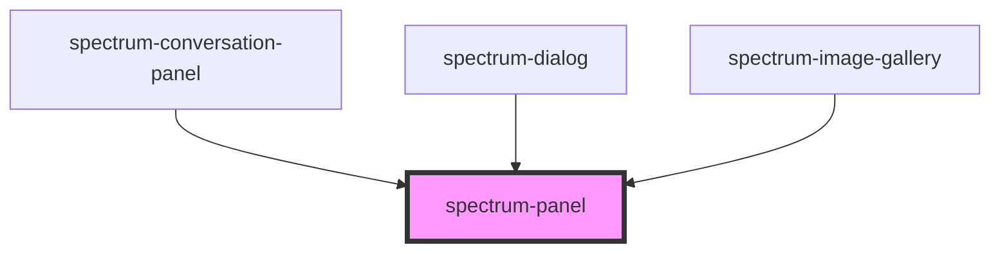

# spectrum-panel

<!-- Auto Generated Below -->

## Properties

| Property        | Attribute        | Description                                                                                                                                               | Type                                                           | Default     |
| --------------- | ---------------- | --------------------------------------------------------------------------------------------------------------------------------------------------------- | -------------------------------------------------------------- | ----------- |
| `background`    | `background`     | Background level for the panel                                                                                                                            | `"full-frost" \| "opaque" \| "partial-frost" \| "transparent"` | `'opaque'`  |
| `debug`         | `debug`          | Whether to enable debug logging                                                                                                                           | `boolean`                                                      | `false`     |
| `frost`         | `frost`          | **[DEPRECATED]** Use background property instead  Whether to apply frost effect (translucent background with blur) | `boolean`                                                      | `false`     |
| `height`        | `height`         | Custom height for the panel Can be any valid CSS height value (e.g., '200px', '100vh', 'auto')                                                            | `string`                                                       | `undefined` |
| `noPadding`     | `no-padding`     | Whether to remove the default padding from the panel Useful when the content needs to extend to the panel edges                                           | `boolean`                                                      | `false`     |
| `panelTitle`    | `panel-title`    | Title to display at the top of the panel                                                                                                                  | `string`                                                       | `undefined` |
| `size`          | `size`           | Size preset for the panel Default: 'full' (occupies all available space)                                                                                  | `"auto" \| "full" \| "large" \| "medium" \| "small"`           | `'full'`    |
| `titleEditable` | `title-editable` | Whether the title should be editable Default: false                                                                                                       | `boolean`                                                      | `false`     |
| `width`         | `width`          | Custom width for the panel (overrides size preset) Can be any valid CSS width value (e.g., '300px', '50%', '20rem')                                       | `string`                                                       | `undefined` |

## Events

| Event          | Description                                                               | Type                                              |
| -------------- | ------------------------------------------------------------------------- | ------------------------------------------------- |
| `titleChanged` | Event emitted when the title is changed (only when titleEditable is true) | `CustomEvent<{ action: string; value: string; }>` |

## Dependencies

### Used by

 - [spectrum-conversation-panel](../spectrum-conversation-panel)
 - [spectrum-dialog](../spectrum-dialog)
 - [spectrum-image-gallery](../spectrum-image-gallery)

### Graph

----------------------------------------------

