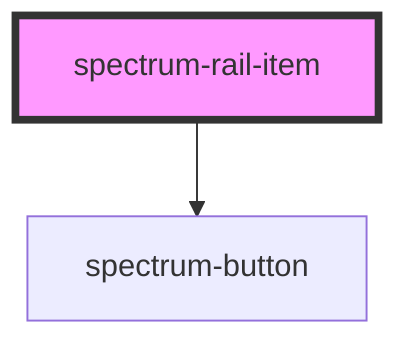

# spectrum-rail-item

<!-- Auto Generated Below -->

## Overview

Spectrum Rail Item Component
A component designed to work within the rail that automatically
switches between icon-only and full display modes

## Properties

| Property             | Attribute  | Description                | Type      | Default     |
| -------------------- | ---------- | -------------------------- | --------- | ----------- |
| `action`             | `action`   | Optional action identifier | `string`  | `undefined` |
| `expanded`           | `expanded` | Current expanded state     | `boolean` | `false`     |
| `icon` _(required)_  | `icon`     | The icon to display        | `string`  | `undefined` |
| `label` _(required)_ | `label`    | The label to display       | `string`  | `undefined` |

## Methods

### `onRailExpandedChange(expanded: boolean) => Promise<boolean>`

Callback for when rail expansion state changes

#### Parameters

| Name       | Type      | Description |
| ---------- | --------- | ----------- |
| `expanded` | `boolean` |             |

#### Returns

Type: `Promise<boolean>`

## Dependencies

### Depends on

- [spectrum-button](../spectrum-button)

### Graph

----------------------------------------------

