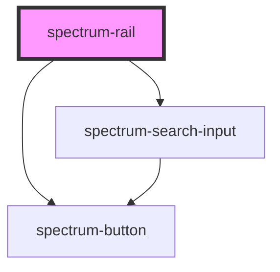

# spectrum-rail

<!-- Auto Generated Below -->

## Overview

Spectrum Rail Component
A vertical navigation rail with two states: expanded and contracted

## Properties

| Property          | Attribute          | Description                                                             | Type      | Default     |
| ----------------- | ------------------ | ----------------------------------------------------------------------- | --------- | ----------- |
| `addIcon`         | `add-icon`         | Add button icon (displayed in both states)                              | `string`  | `'add'`     |
| `addLabel`        | `add-label`        | Add button label (displayed in expanded state)                          | `string`  | `'Add new'` |
| `appName`         | `app-name`         | Application name to display in expanded menu                            | `string`  | `''`        |
| `collapsedOffset` | `collapsed-offset` | Offset from the left when rail is collapsed (e.g. '20px', '1rem', etc.) | `string`  | `'0px'`     |
| `expandedWidth`   | `expanded-width`   | Expanded width for the rail (with units like px, rem, etc.)             | `number`  | `280`       |
| `initialExpanded` | `initial-expanded` | Whether the rail should be initially expanded                           | `boolean` | `false`     |
| `moreLabel`       | `more-label`       | More section label (displayed in expanded state)                        | `string`  | `'More'`    |
| `showAddButton`   | `show-add-button`  | Whether to show the add button in the rail                              | `boolean` | `true`      |

## Events

| Event            | Description                                | Type                                           |
| ---------------- | ------------------------------------------ | ---------------------------------------------- |
| `addAction`      | Emits when the add button is clicked       | `CustomEvent<void>`                            |
| `expandedChange` | Emits when the rail changes expanded state | `CustomEvent<boolean>`                         |
| `railAction`     | Emits when a rail action is triggered      | `CustomEvent<{ action: string; id: string; }>` |
| `searchChange`   | Emits when the search value changes        | `CustomEvent<{ value: string; }>`              |

## Methods

### `setExpanded(expanded: boolean) => Promise<boolean>`

Method that can be called by parent components to programmatically 
control the expanded state

#### Parameters

| Name       | Type      | Description |
| ---------- | --------- | ----------- |
| `expanded` | `boolean` |             |

#### Returns

Type: `Promise<boolean>`

### `setShowAddButton(show: boolean) => Promise<boolean>`

Method to programmatically control the add button visibility

#### Parameters

| Name   | Type      | Description |
| ------ | --------- | ----------- |
| `show` | `boolean` |             |

#### Returns

Type: `Promise<boolean>`

## Dependencies

### Depends on

- [spectrum-button](../spectrum-button)
- [spectrum-search-input](../spectrum-search-input)

### Graph

----------------------------------------------

