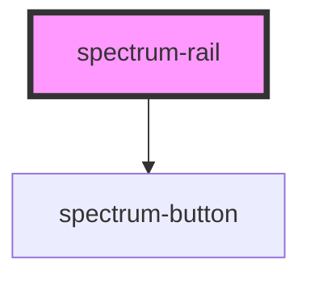

# spectrum-rail

<!-- Auto Generated Below -->

## Properties

| Property      | Attribute | Description                                | Type         | Default     |
| ------------- | --------- | ------------------------------------------ | ------------ | ----------- |
| `bottomItems` | --        | Bottom section items                       | `RailItem[]` | `[]`        |
| `fabItem`     | --        | Optional FAB (Floating Action Button) item | `RailItem`   | `undefined` |
| `menuItem`    | --        | Optional menu item at the top              | `RailItem`   | `undefined` |
| `topItems`    | --        | Top section items                          | `RailItem[]` | `[]`        |

## Events

| Event        | Description                       | Type                                              |
| ------------ | --------------------------------- | ------------------------------------------------- |
| `railAction` | Emits when a rail item is clicked | `CustomEvent<{ action: string; label: string; }>` |

## Dependencies

### Depends on

- [spectrum-button](../spectrum-button)

### Graph

----------------------------------------------

