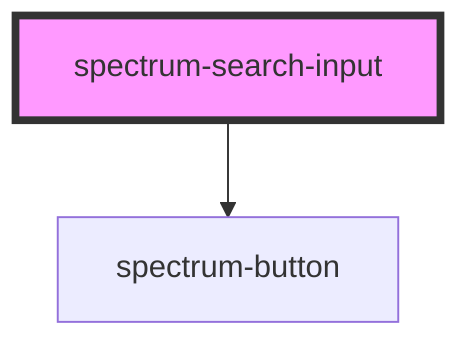

# spectrum-search-input

<!-- Auto Generated Below -->

## Properties

| Property   | Attribute   | Description | Type     | Default |
| ---------- | ----------- | ----------- | -------- | ------- |
| `maxLines` | `max-lines` |             | `number` | `4`     |

## Events

| Event          | Description | Type                  |
| -------------- | ----------- | --------------------- |
| `searchSubmit` |             | `CustomEvent<string>` |

## Methods

### `setFocus() => Promise<void>`

#### Returns

Type: `Promise<void>`

## Dependencies

### Depends on

- [spectrum-button](../spectrum-button)

### Graph

----------------------------------------------

