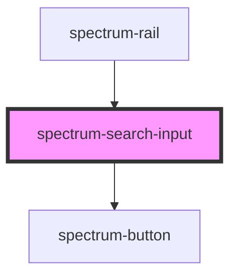

# spectrum-search-input

<!-- Auto Generated Below -->

## Properties

| Property              | Attribute               | Description                                                     | Type                   | Default             |
| --------------------- | ----------------------- | --------------------------------------------------------------- | ---------------------- | ------------------- |
| `enableEnterSubmit`   | `enable-enter-submit`   | Whether to enable submitting search on Enter key press          | `boolean`              | `true`              |
| `enableVoiceInput`    | `enable-voice-input`    | Whether to enable voice input capabilities (speech recognition) | `boolean`              | `true`              |
| `maxLines`            | `max-lines`             |                                                                 | `number`               | `4`                 |
| `placeholder`         | `placeholder`           | Placeholder text for the search input                           | `string`               | `'Ask anything...'` |
| `searchButtonVariant` | `search-button-variant` | Variant of the search button - 'primary' or 'ghost'             | `"ghost" \| "primary"` | `'primary'`         |
| `searchIconPosition`  | `search-icon-position`  | Position of the search icon - 'left' or 'right'                 | `"left" \| "right"`    | `'right'`           |

## Events

| Event          | Description                                             | Type                                              |
| -------------- | ------------------------------------------------------- | ------------------------------------------------- |
| `searchInput`  | Emits when input value changes, for real-time filtering | `CustomEvent<{ action: string; value: string; }>` |
| `searchSubmit` |                                                         | `CustomEvent<{ action: string; value: string; }>` |

## Methods

### `setFocus() => Promise<void>`

#### Returns

Type: `Promise<void>`

## Dependencies

### Used by

 - [spectrum-rail](../spectrum-rail)

### Depends on

- [spectrum-button](../spectrum-button)

### Graph

----------------------------------------------

