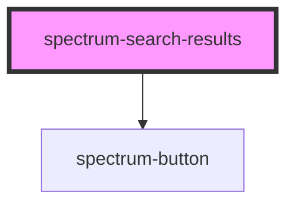

# spectrum-search-results

<!-- Auto Generated Below -->

## Properties

| Property         | Attribute          | Description                                                                                                                                        | Type                          | Default                                                                                               |
| ---------------- | ------------------ | -------------------------------------------------------------------------------------------------------------------------------------------------- | ----------------------------- | ----------------------------------------------------------------------------------------------------- |
| `data`           | `data`             | Search results data containing results array and pagination info                                                                                   | `SearchResultsData \| string` | `{ results: [], pagination: { currentPage: 1, totalPages: 1, totalResults: 0, resultsPerPage: 10 } }` |
| `emptyMessage`   | `empty-message`    | Empty state message                                                                                                                                | `string`                      | `'No results found'`                                                                                  |
| `enableUrlSync`  | `enable-url-sync`  | Enable URL synchronization for pagination state                                                                                                    | `boolean`                     | `false`                                                                                               |
| `loading`        | `loading`          | Loading state                                                                                                                                      | `boolean`                     | `false`                                                                                               |
| `maxPageButtons` | `max-page-buttons` | Maximum number of page buttons to show in pagination                                                                                               | `number`                      | `5`                                                                                                   |
| `pageParam`      | `page-param`       | URL parameter name for page number (default: 'page')                                                                                               | `string`                      | `'page'`                                                                                              |
| `resultTemplate` | `result-template`  | Custom result template slot name                                                                                                                   | `string`                      | `undefined`                                                                                           |
| `resultsPerPage` | `results-per-page` | Number of results to display per page                                                                                                              | `number`                      | `10`                                                                                                  |
| `showMetadata`   | `show-metadata`    | Show result metadata                                                                                                                               | `boolean`                     | `true`                                                                                                |
| `showPagination` | `show-pagination`  | Show pagination controls                                                                                                                           | `boolean`                     | `true`                                                                                                |
| `showScores`     | `show-scores`      | Show result scores if available                                                                                                                    | `boolean`                     | `false`                                                                                               |
| `showThumbnails` | `show-thumbnails`  | Show result thumbnails if available                                                                                                                | `boolean`                     | `true`                                                                                                |
| `sizeParam`      | `size-param`       | URL parameter name for results per page (default: 'size')                                                                                          | `string`                      | `'size'`                                                                                              |
| `translations`   | `translations`     | Translation object for customizing all user-facing text. Provide only the strings you want to override - missing values will use English defaults. | `SearchResultsTranslations`   | `{}`                                                                                                  |

## Events

| Event              | Description                                                | Type                                     |
| ------------------ | ---------------------------------------------------------- | ---------------------------------------- |
| `paginationAction` | Emitted when pagination controls are used                  | `CustomEvent<PaginationActionPayload>`   |
| `resultAction`     | Emitted when a search result is clicked or interacted with | `CustomEvent<SearchResultActionPayload>` |

## Methods

### `getPaginationState() => Promise<{ currentPage: number; totalPages: number; totalResults: number; resultsPerPage: number; urlParams: { page: number; size: number; }; }>`

Get current pagination state including URL parameters

#### Returns

Type: `Promise<{ currentPage: number; totalPages: number; totalResults: number; resultsPerPage: number; urlParams: { page: number; size: number; }; }>`

### `navigateToPage(page: number, updateUrl?: boolean) => Promise<void>`

Navigate to a specific page programmatically

#### Parameters

| Name        | Type      | Description                                                           |
| ----------- | --------- | --------------------------------------------------------------------- |
| `page`      | `number`  | - The page number to navigate to                                      |
| `updateUrl` | `boolean` | - Whether to update the URL (default: respects enableUrlSync setting) |

#### Returns

Type: `Promise<void>`

## Dependencies

### Depends on

- [spectrum-button](../spectrum-button)

### Graph

----------------------------------------------

