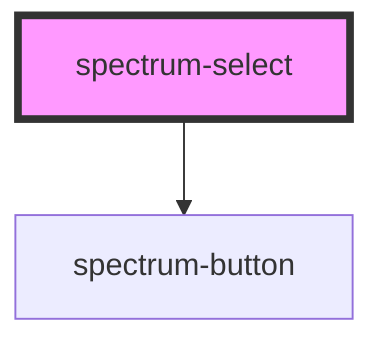

# spectrum-select

<!-- Auto Generated Below -->

## Overview

Spectrum Select Component
A comprehensive select component with advanced features including search, loading states,
enhanced animations, mobile optimization, and accessibility improvements.
Based on the Spectrum design system and Material Design 3 patterns.

## Properties

| Property            | Attribute            | Description                                                     | Type                                               | Default               |
| ------------------- | -------------------- | --------------------------------------------------------------- | -------------------------------------------------- | --------------------- |
| `action`            | `action`             |                                                                 | `string`                                           | `''`                  |
| `customStyle`       | `custom-style`       |                                                                 | `{ [key: string]: string; }`                       | `{}`                  |
| `debug`             | `debug`              |                                                                 | `boolean`                                          | `false`               |
| `disabled`          | `disabled`           |                                                                 | `boolean`                                          | `false`               |
| `dropdownIcon`      | `dropdown-icon`      |                                                                 | `string`                                           | `'expand_more'`       |
| `errorText`         | `error-text`         |                                                                 | `string`                                           | `''`                  |
| `invalid`           | `invalid`            |                                                                 | `boolean`                                          | `false`               |
| `itemHeight`        | `item-height`        |                                                                 | `number`                                           | `40`                  |
| `loading`           | `loading`            |                                                                 | `boolean`                                          | `false`               |
| `loadingText`       | `loading-text`       |                                                                 | `string`                                           | `'Loading...'`        |
| `maxHeight`         | `max-height`         |                                                                 | `string`                                           | `'200px'`             |
| `mobileFullscreen`  | `mobile-fullscreen`  |                                                                 | `boolean`                                          | `false`               |
| `multiple`          | `multiple`           |                                                                 | `boolean`                                          | `false`               |
| `noResultsText`     | `no-results-text`    |                                                                 | `string`                                           | `'No results found'`  |
| `options`           | `options`            | Array of select options or JSON string representing the options | `SpectrumSelectOption[] \| string`                 | `[]`                  |
| `placeholder`       | `placeholder`        |                                                                 | `string`                                           | `'Select an option'`  |
| `required`          | `required`           |                                                                 | `boolean`                                          | `false`               |
| `searchPlaceholder` | `search-placeholder` |                                                                 | `string`                                           | `'Search options...'` |
| `searchTitle`       | `search-title`       |                                                                 | `string`                                           | `''`                  |
| `searchable`        | `searchable`         |                                                                 | `boolean`                                          | `false`               |
| `selectAllText`     | `select-all-text`    |                                                                 | `string`                                           | `'Select All'`        |
| `selectedValue`     | `selected-value`     |                                                                 | `string`                                           | `''`                  |
| `selectedValues`    | `selected-values`    |                                                                 | `string[]`                                         | `[]`                  |
| `selectionsLabel`   | `selections-label`   |                                                                 | `string`                                           | `'selections'`        |
| `showDropdownIcon`  | `show-dropdown-icon` |                                                                 | `boolean`                                          | `true`                |
| `showIcon`          | `show-icon`          |                                                                 | `boolean`                                          | `true`                |
| `showSelectAll`     | `show-select-all`    |                                                                 | `boolean`                                          | `false`               |
| `size`              | `size`               |                                                                 | `"base" \| "lg" \| "sm"`                           | `'base'`              |
| `state`             | `state`              |                                                                 | `"default" \| "disabled" \| "focus" \| "hover"`    | `'default'`           |
| `touchOptimized`    | `touch-optimized`    |                                                                 | `boolean`                                          | `true`                |
| `variant`           | `variant`            |                                                                 | `"ghost" \| "outline" \| "primary" \| "secondary"` | `'primary'`           |
| `virtualScrolling`  | `virtual-scrolling`  |                                                                 | `boolean`                                          | `false`               |

## Events

| Event           | Description | Type                                                                                                                                                |
| --------------- | ----------- | --------------------------------------------------------------------------------------------------------------------------------------------------- |
| `dropdownClose` |             | `CustomEvent<void>`                                                                                                                                 |
| `dropdownOpen`  |             | `CustomEvent<void>`                                                                                                                                 |
| `searchChange`  |             | `CustomEvent<string>`                                                                                                                               |
| `selectChange`  |             | `CustomEvent<{ value: string; label: string; option: SpectrumSelectOption; selectedValues?: string[]; selectedOptions?: SpectrumSelectOption[]; }>` |

## Dependencies

### Depends on

- [spectrum-button](../spectrum-button)

### Graph

----------------------------------------------

