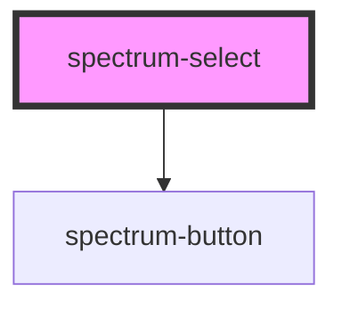

# spectrum-select

<!-- Auto Generated Below -->

## Overview

Spectrum Select Component
A comprehensive select component with advanced features including search, loading states,
enhanced animations, mobile optimization, and accessibility improvements.
Based on the Spectrum design system and Material Design 3 patterns.

## Properties

| Property            | Attribute            | Description | Type                                               | Default               |
| ------------------- | -------------------- | ----------- | -------------------------------------------------- | --------------------- |
| `action`            | `action`             |             | `string`                                           | `''`                  |
| `customStyle`       | --                   |             | `{ [key: string]: string; }`                       | `{}`                  |
| `debug`             | `debug`              |             | `boolean`                                          | `false`               |
| `disabled`          | `disabled`           |             | `boolean`                                          | `false`               |
| `dropdownIcon`      | `dropdown-icon`      |             | `string`                                           | `'expand_more'`       |
| `errorText`         | `error-text`         |             | `string`                                           | `''`                  |
| `invalid`           | `invalid`            |             | `boolean`                                          | `false`               |
| `itemHeight`        | `item-height`        |             | `number`                                           | `40`                  |
| `loading`           | `loading`            |             | `boolean`                                          | `false`               |
| `loadingText`       | `loading-text`       |             | `string`                                           | `'Loading...'`        |
| `maxHeight`         | `max-height`         |             | `string`                                           | `'200px'`             |
| `mobileFullscreen`  | `mobile-fullscreen`  |             | `boolean`                                          | `false`               |
| `multiple`          | `multiple`           |             | `boolean`                                          | `false`               |
| `noResultsText`     | `no-results-text`    |             | `string`                                           | `'No results found'`  |
| `options`           | --                   |             | `SpectrumSelectOption[]`                           | `[]`                  |
| `placeholder`       | `placeholder`        |             | `string`                                           | `'Select an option'`  |
| `required`          | `required`           |             | `boolean`                                          | `false`               |
| `searchPlaceholder` | `search-placeholder` |             | `string`                                           | `'Search options...'` |
| `searchTitle`       | `search-title`       |             | `string`                                           | `''`                  |
| `searchable`        | `searchable`         |             | `boolean`                                          | `false`               |
| `selectAllText`     | `select-all-text`    |             | `string`                                           | `'Select All'`        |
| `selectedValue`     | `selected-value`     |             | `string`                                           | `''`                  |
| `selectedValues`    | --                   |             | `string[]`                                         | `[]`                  |
| `selectionsLabel`   | `selections-label`   |             | `string`                                           | `'selections'`        |
| `showDropdownIcon`  | `show-dropdown-icon` |             | `boolean`                                          | `true`                |
| `showIcon`          | `show-icon`          |             | `boolean`                                          | `true`                |
| `showSelectAll`     | `show-select-all`    |             | `boolean`                                          | `false`               |
| `size`              | `size`               |             | `"base" \| "lg" \| "sm"`                           | `'base'`              |
| `state`             | `state`              |             | `"default" \| "disabled" \| "focus" \| "hover"`    | `'default'`           |
| `touchOptimized`    | `touch-optimized`    |             | `boolean`                                          | `true`                |
| `variant`           | `variant`            |             | `"ghost" \| "outline" \| "primary" \| "secondary"` | `'primary'`           |
| `virtualScrolling`  | `virtual-scrolling`  |             | `boolean`                                          | `false`               |

## Events

| Event           | Description | Type                                                                                                                                                |
| --------------- | ----------- | --------------------------------------------------------------------------------------------------------------------------------------------------- |
| `dropdownClose` |             | `CustomEvent<void>`                                                                                                                                 |
| `dropdownOpen`  |             | `CustomEvent<void>`                                                                                                                                 |
| `searchChange`  |             | `CustomEvent<string>`                                                                                                                               |
| `selectChange`  |             | `CustomEvent<{ value: string; label: string; option: SpectrumSelectOption; selectedValues?: string[]; selectedOptions?: SpectrumSelectOption[]; }>` |

## Keyboard Navigation

The spectrum-select component provides comprehensive keyboard navigation support for accessibility and power user workflows.

### Opening the Dropdown

| Key | Action |
| --- | ------ |
| `Enter` | Opens the dropdown when focused on the select trigger |
| `Space` | Opens the dropdown when focused on the select trigger |
| `Arrow Down` | Opens the dropdown and focuses the first option |
| `Arrow Up` | Opens the dropdown and focuses the first option |

### Navigating Options

| Key | Action |
| --- | ------ |
| `Arrow Down` | Move focus to the next option in the list |
| `Arrow Up` | Move focus to the previous option in the list |
| `Home` | Move focus to the first option in the list |
| `End` | Move focus to the last option in the list |

### Selecting Options

| Key | Action |
| --- | ------ |
| `Enter` | Select the currently focused option (closes dropdown in single-select mode) |
| `Space` | Select the currently focused option (closes dropdown in single-select mode) |

### Closing the Dropdown

| Key | Action |
| --- | ------ |
| `Escape` | Close the dropdown and return focus to the select trigger |
| `Tab` | Close the dropdown and move focus to the next focusable element |
| `Shift + Tab` | Close the dropdown and move focus to the previous focusable element |

### Search Mode Navigation

When the dropdown is searchable (`searchable={true}`), additional keyboard behavior is available:

| Key | Action |
| --- | ------ |
| `Arrow Down` | Switch focus from search input to first option (if available) |
| `Arrow Up` | Switch focus from search input to last option (if available) |
| `Escape` | Clear search and close dropdown |
| `Enter` | Select first option if only one result matches the search |

### Accessibility Features

- **Screen Reader Support**: All options are properly labeled with ARIA attributes
- **Focus Management**: Visual focus indicators clearly show the current selection
- **Keyboard Trapping**: Focus remains within the dropdown when open
- **Live Regions**: Search results are announced to screen readers
- **Role Declarations**: Proper ARIA roles for listbox and option elements

### Multi-Select Keyboard Behavior

In multi-select mode (`multiple={true}`), the following additional behaviors apply:

- `Enter` or `Space` toggles selection without closing the dropdown
- Selected options remain visually indicated with checkboxes
- The dropdown stays open to allow multiple selections
- Use `Escape` to close and complete the multi-selection

### Best Practices

1. **Focus Management**: Always ensure the select trigger can receive keyboard focus
2. **Clear Labeling**: Use descriptive option labels for screen reader users
3. **Logical Order**: Arrange options in a logical sequence for keyboard navigation
4. **Search Integration**: Enable search for long option lists to improve keyboard usability
5. **Error Handling**: Provide clear error messages when validation fails

## Dependencies

### Depends on

- [spectrum-button](../spectrum-button)

### Graph

----------------------------------------------

