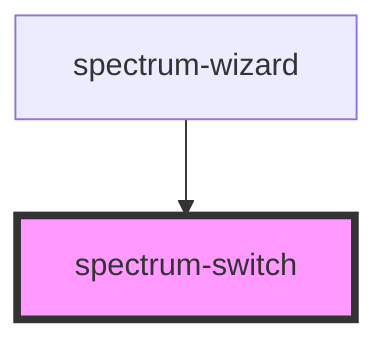

# spectrum-switch

<!-- Auto Generated Below -->

## Overview

Spectrum Switch Component
A toggle switch component with multiple variants and accessibility support.
Supports Material Icons and follows spectrum design system.

## Properties

| Property                | Attribute                 | Description | Type                                                       | Default     |
| ----------------------- | ------------------------- | ----------- | ---------------------------------------------------------- | ----------- |
| `accessibleDescribedBy` | `accessible-described-by` |             | `string`                                                   | `undefined` |
| `accessibleLabel`       | `accessible-label`        |             | `string`                                                   | `undefined` |
| `accessibleLabelledBy`  | `accessible-labelled-by`  |             | `string`                                                   | `undefined` |
| `checked`               | `checked`                 |             | `boolean`                                                  | `false`     |
| `disabled`              | `disabled`                |             | `boolean`                                                  | `false`     |
| `label`                 | `label`                   |             | `string`                                                   | `undefined` |
| `loading`               | `loading`                 |             | `boolean`                                                  | `false`     |
| `name`                  | `name`                    |             | `string`                                                   | `undefined` |
| `showIcons`             | `show-icons`              |             | `boolean`                                                  | `true`      |
| `size`                  | `size`                    |             | `"base" \| "large" \| "lg" \| "medium" \| "sm" \| "small"` | `'base'`    |
| `value`                 | `value`                   |             | `string`                                                   | `undefined` |
| `variant`               | `variant`                 |             | `"caution" \| "destructive" \| "positive" \| "primary"`    | `'primary'` |

## Events

| Event          | Description | Type                                                                 |
| -------------- | ----------- | -------------------------------------------------------------------- |
| `switchChange` |             | `CustomEvent<{ action: string; checked: boolean; value?: string; }>` |

## Dependencies

### Used by

 - [spectrum-wizard](../spectrum-wizard)

### Graph

----------------------------------------------

