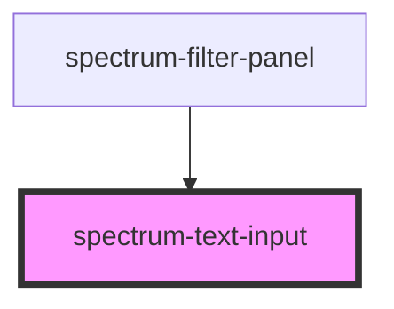

# spectrum-text-input

<!-- Auto Generated Below -->

## Overview

Text Input Component

A versatile text input component supporting various input types,
validation states, and Spectrum theming.

## Properties

| Property       | Attribute       | Description                                | Type                                                                                                                | Default     |
| -------------- | --------------- | ------------------------------------------ | ------------------------------------------------------------------------------------------------------------------- | ----------- |
| `autocomplete` | `autocomplete`  | Autocomplete attribute                     | `string`                                                                                                            | `undefined` |
| `clearable`    | `clearable`     | Whether to show clear button               | `boolean`                                                                                                           | `false`     |
| `disabled`     | `disabled`      | Whether the input is disabled              | `boolean`                                                                                                           | `false`     |
| `errorMessage` | `error-message` | Error message (shows error state when set) | `string`                                                                                                            | `undefined` |
| `helperText`   | `helper-text`   | Helper text shown below the input          | `string`                                                                                                            | `undefined` |
| `inputId`      | `input-id`      | Unique ID for the input                    | `string`                                                                                                            | `undefined` |
| `label`        | `label`         | Label text                                 | `string`                                                                                                            | `undefined` |
| `leadingIcon`  | `leading-icon`  | Leading icon (Material Symbols name)       | `string`                                                                                                            | `undefined` |
| `max`          | `max`           | Maximum value (for number/date types)      | `number \| string`                                                                                                  | `undefined` |
| `maxlength`    | `maxlength`     | Maximum length                             | `number`                                                                                                            | `undefined` |
| `min`          | `min`           | Minimum value (for number/date types)      | `number \| string`                                                                                                  | `undefined` |
| `minlength`    | `minlength`     | Minimum length                             | `number`                                                                                                            | `undefined` |
| `name`         | `name`          | Input name attribute                       | `string`                                                                                                            | `undefined` |
| `pattern`      | `pattern`       | Pattern for validation                     | `string`                                                                                                            | `undefined` |
| `placeholder`  | `placeholder`   | Placeholder text                           | `string`                                                                                                            | `''`        |
| `readonly`     | `readonly`      | Whether the input is readonly              | `boolean`                                                                                                           | `false`     |
| `required`     | `required`      | Whether the input is required              | `boolean`                                                                                                           | `false`     |
| `size`         | `size`          | Size variant                               | `"large" \| "medium" \| "small"`                                                                                    | `'medium'`  |
| `step`         | `step`          | Step value (for number type)               | `number \| string`                                                                                                  | `undefined` |
| `trailingIcon` | `trailing-icon` | Trailing icon (Material Symbols name)      | `string`                                                                                                            | `undefined` |
| `type`         | `type`          | Input type                                 | `"date" \| "datetime-local" \| "email" \| "number" \| "password" \| "search" \| "tel" \| "text" \| "time" \| "url"` | `'text'`    |
| `value`        | `value`         | Input value                                | `string`                                                                                                            | `''`        |

## Events

| Event               | Description                              | Type                  |
| ------------------- | ---------------------------------------- | --------------------- |
| `inputBlur`         | Emitted when input loses focus           | `CustomEvent<void>`   |
| `inputChange`       | Emitted when input value changes         | `CustomEvent<string>` |
| `inputClear`        | Emitted when clear button is clicked     | `CustomEvent<void>`   |
| `inputFocus`        | Emitted when input receives focus        | `CustomEvent<void>`   |
| `inputInput`        | Emitted on input event (every keystroke) | `CustomEvent<string>` |
| `trailingIconClick` | Emitted when trailing icon is clicked    | `CustomEvent<void>`   |

## Slots

| Slot       | Description                         |
| ---------- | ----------------------------------- |
| `"prefix"` | Content to display before the input |
| `"suffix"` | Content to display after the input  |

## Dependencies

### Used by

 - [spectrum-filter-panel](../spectrum-filter-panel)

### Graph

----------------------------------------------

