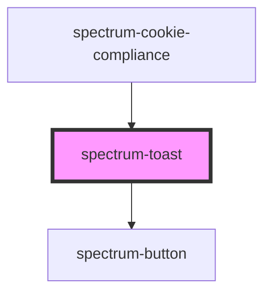

# spectrum-toast

<!-- Auto Generated Below -->

## Overview

Spectrum Toast Component
A notification component that displays messages at screen edges.
Supports various variants, positioning, auto-dismiss functionality, and custom sizing.

## Properties

| Property          | Attribute           | Description | Type                                                                                                     | Default     |
| ----------------- | ------------------- | ----------- | -------------------------------------------------------------------------------------------------------- | ----------- |
| `actionLabel`     | `action-label`      |             | `string`                                                                                                 | `''`        |
| `actionValue`     | `action-value`      |             | `string`                                                                                                 | `''`        |
| `autoClose`       | `auto-close`        |             | `boolean`                                                                                                | `true`      |
| `debug`           | `debug`             |             | `boolean`                                                                                                | `false`     |
| `dismissible`     | `dismissible`       |             | `boolean`                                                                                                | `true`      |
| `duration`        | `duration`          |             | `number`                                                                                                 | `4000`      |
| `icon`            | `icon`              |             | `string`                                                                                                 | `''`        |
| `maxWidth`        | `max-width`         |             | `string`                                                                                                 | `''`        |
| `message`         | `message`           |             | `string`                                                                                                 | `''`        |
| `minWidth`        | `min-width`         |             | `string`                                                                                                 | `''`        |
| `persistent`      | `persistent`        |             | `boolean`                                                                                                | `false`     |
| `position`        | `position`          |             | `"bottom" \| "bottom-left" \| "bottom-right" \| "left" \| "right" \| "top" \| "top-left" \| "top-right"` | `'top'`     |
| `showCloseButton` | `show-close-button` |             | `boolean`                                                                                                | `true`      |
| `showIcon`        | `show-icon`         |             | `boolean`                                                                                                | `true`      |
| `toastTitle`      | `toast-title`       |             | `string`                                                                                                 | `''`        |
| `variant`         | `variant`           |             | `"danger" \| "ghost" \| "primary" \| "secondary" \| "success" \| "warning"`                              | `'primary'` |
| `visible`         | `visible`           |             | `boolean`                                                                                                | `false`     |

## Events

| Event          | Description | Type                                           |
| -------------- | ----------- | ---------------------------------------------- |
| `toastAction`  |             | `CustomEvent<{ action: string; toast: any; }>` |
| `toastDismiss` |             | `CustomEvent<{ action: string; toast: any; }>` |

## Methods

### `dismiss() => Promise<void>`

#### Returns

Type: `Promise<void>`

### `hide() => Promise<void>`

#### Returns

Type: `Promise<void>`

### `show() => Promise<void>`

#### Returns

Type: `Promise<void>`

## Dependencies

### Used by

 - [spectrum-cookie-compliance](../spectrum-cookie-compliance)

### Depends on

- [spectrum-button](../spectrum-button)

### Graph

----------------------------------------------

