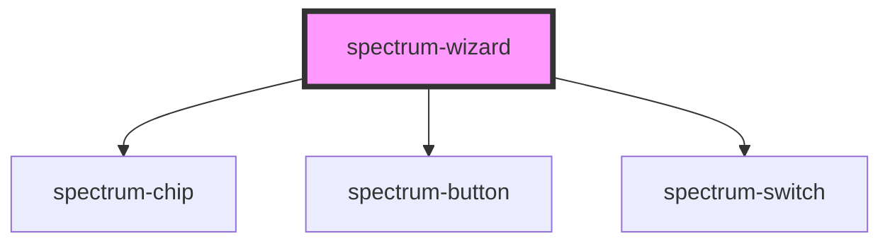

# spectrum-wizard

<!-- Auto Generated Below -->

## Overview

Spectrum Wizard Component

A step-by-step guided experience component that provides navigation,
progress tracking, and optional cookie-based persistence.

Cookie persistence is disabled by default for privacy. Enable it by setting
persistProgress={true} and providing a unique wizardId.

## Properties

| Property               | Attribute                | Description                                                 | Type                     | Default             |
| ---------------------- | ------------------------ | ----------------------------------------------------------- | ------------------------ | ------------------- |
| `allowStepSelection`   | `allow-step-selection`   | Allow jumping to any accessible step                        | `boolean`                | `true`              |
| `completeButtonLabel`  | `complete-button-label`  | Label for the complete button                               | `string`                 | `'Complete'`        |
| `cookieExpirationDays` | `cookie-expiration-days` | Cookie expiration in days                                   | `number`                 | `30`                |
| `currentStep`          | `current-step`           | Current active step index (0-based)                         | `number`                 | `0`                 |
| `nextButtonLabel`      | `next-button-label`      | Label for the next button                                   | `string`                 | `'Next'`            |
| `persistProgress`      | `persist-progress`       | Whether to persist progress in cookies (opt-in)             | `boolean`                | `false`             |
| `previousButtonLabel`  | `previous-button-label`  | Label for the previous button                               | `string`                 | `'Previous'`        |
| `showNavigation`       | `show-navigation`        | Whether navigation controls are shown                       | `boolean`                | `true`              |
| `showTimeIndicators`   | `show-time-indicators`   | Show time indicators for steps                              | `boolean`                | `true`              |
| `steps`                | `steps`                  | Array of wizard steps or JSON string representing the steps | `WizardStep[] \| string` | `[]`                |
| `wizardId`             | `wizard-id`              | Unique identifier for cookie persistence                    | `string`                 | `'spectrum-wizard'` |

## Events

| Event            | Description                      | Type                                 |
| ---------------- | -------------------------------- | ------------------------------------ |
| `stepChange`     | Emitted when step changes        | `CustomEvent<WizardStepChangeEvent>` |
| `wizardComplete` | Emitted when wizard is completed | `CustomEvent<WizardCompleteEvent>`   |

## Methods

### `completeWizard() => Promise<void>`

Complete the wizard

#### Returns

Type: `Promise<void>`

### `getTotalEstimatedTime() => Promise<number>`

Get total estimated time for all steps

#### Returns

Type: `Promise<number>`

### `goToStep(stepIndex: number) => Promise<boolean>`

Navigate to specific step

#### Parameters

| Name        | Type     | Description |
| ----------- | -------- | ----------- |
| `stepIndex` | `number` |             |

#### Returns

Type: `Promise<boolean>`

### `nextStep() => Promise<boolean>`

Navigate to next step

#### Returns

Type: `Promise<boolean>`

### `previousStep() => Promise<boolean>`

Navigate to previous step

#### Returns

Type: `Promise<boolean>`

### `resetProgress() => Promise<void>`

Reset wizard progress

#### Returns

Type: `Promise<void>`

## Dependencies

### Depends on

- [spectrum-chip](../spectrum-chip)
- [spectrum-button](../spectrum-button)
- [spectrum-switch](../spectrum-switch)

### Graph

----------------------------------------------

