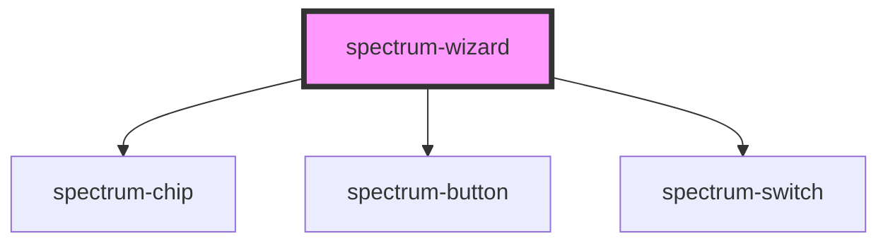

# spectrum-wizard

A powerful step-by-step wizard component with three flexible ways to add content:

## Content Options

### 1. HTML Strings (Simple)
Perfect for simple content that doesn't need external CSS:
```html
<spectrum-wizard></spectrum-wizard>
<script>
  const wizard = document.querySelector('spectrum-wizard');
  wizard.steps = [
    { id: '1', title: 'Welcome', content: '<p>Simple HTML content</p>' },
    { id: '2', title: 'Details', content: '<p>More content</p>' }
  ];
</script>
```

### 2. Slotted Content (Full External CSS Support)
Use slots for rich content with full external CSS styling:
```html
<style>
  .custom-heading { color: #ff6b6b; font-weight: bold; }
  .highlight { background: yellow; padding: 1rem; }
</style>

<spectrum-wizard></spectrum-wizard>
<script>
  const wizard = document.querySelector('spectrum-wizard');
  wizard.steps = [
    { id: '1', title: 'Welcome', slotName: 'step-1', estimatedTime: 5 },
    { id: '2', title: 'Details', slotName: 'step-2', estimatedTime: 10 }
  ];
</script>
```
```html
<!-- Slotted content with external CSS -->
<spectrum-wizard>
  <div slot="step-1">
    <h3 class="custom-heading">Welcome!</h3>
    <p class="highlight">This content can use external CSS!</p>
  </div>
  <div slot="step-2">
    <h3 class="custom-heading">More Details</h3>
    <p>Step 2 content with full styling control</p>
  </div>
</spectrum-wizard>
```

### 3. External Styles Injection (Shadow DOM Styling)
Inject CSS into shadow DOM to style HTML string content:
```html
<spectrum-wizard 
  external-styles="
    p { font-size: 1.2rem; color: #333; }
    .highlight { background: yellow; padding: 0.5rem; }
    h3 { color: #0070d2; }
  ">
</spectrum-wizard>
<script>
  const wizard = document.querySelector('spectrum-wizard');
  wizard.steps = [
    { 
      id: '1', 
      title: 'Styled Content', 
      content: '<h3>Title</h3><p class="highlight">Styled paragraph</p>' 
    }
  ];
</script>
```

## Mixed Approaches
You can mix and match content types in a single wizard:
```javascript
wizard.steps = [
  { id: '1', title: 'Intro', content: '<p>Simple HTML</p>' },
  { id: '2', title: 'Details', slotName: 'step-2' }, // Uses slot
  { id: '3', title: 'Summary', content: '<p>Back to HTML</p>' }
];
```

<!-- Auto Generated Below -->


## Overview

Spectrum Wizard Component

A step-by-step guided experience component that provides navigation,
progress tracking, and optional cookie-based persistence.

Cookie persistence is disabled by default for privacy. Enable it by setting
persistProgress={true} and providing a unique wizardId.

## Properties

| Property               | Attribute                | Description                                                            | Type                     | Default             |
| ---------------------- | ------------------------ | ---------------------------------------------------------------------- | ------------------------ | ------------------- |
| `allowStepSelection`   | `allow-step-selection`   | Allow jumping to any accessible step                                   | `boolean`                | `true`              |
| `completeButtonLabel`  | `complete-button-label`  | Label for the complete button                                          | `string`                 | `'Complete'`        |
| `cookieExpirationDays` | `cookie-expiration-days` | Cookie expiration in days                                              | `number`                 | `30`                |
| `currentStep`          | `current-step`           | Current active step index (0-based)                                    | `number`                 | `0`                 |
| `externalStyles`       | `external-styles`        | External CSS styles to inject into shadow DOM for styling step content | `string`                 | `undefined`         |
| `nextButtonLabel`      | `next-button-label`      | Label for the next button                                              | `string`                 | `'Next'`            |
| `persistProgress`      | `persist-progress`       | Whether to persist progress in cookies (opt-in)                        | `boolean`                | `false`             |
| `previousButtonLabel`  | `previous-button-label`  | Label for the previous button                                          | `string`                 | `'Previous'`        |
| `showNavigation`       | `show-navigation`        | Whether navigation controls are shown                                  | `boolean`                | `true`              |
| `showTimeIndicators`   | `show-time-indicators`   | Show time indicators for steps                                         | `boolean`                | `true`              |
| `steps`                | `steps`                  | Array of wizard steps or JSON string representing the steps            | `WizardStep[] \| string` | `[]`                |
| `wizardId`             | `wizard-id`              | Unique identifier for cookie persistence                               | `string`                 | `'spectrum-wizard'` |


## Events

| Event            | Description                      | Type                                 |
| ---------------- | -------------------------------- | ------------------------------------ |
| `stepChange`     | Emitted when step changes        | `CustomEvent<WizardStepChangeEvent>` |
| `wizardComplete` | Emitted when wizard is completed | `CustomEvent<WizardCompleteEvent>`   |


## Methods

### `completeWizard() => Promise<void>`

Complete the wizard

#### Returns

Type: `Promise<void>`


### `getTotalEstimatedTime() => Promise<number>`

Get total estimated time for all steps

#### Returns

Type: `Promise<number>`


### `goToStep(stepIndex: number) => Promise<boolean>`

Navigate to specific step

#### Parameters

| Name        | Type     | Description |
| ----------- | -------- | ----------- |
| `stepIndex` | `number` |             |

#### Returns

Type: `Promise<boolean>`


### `nextStep() => Promise<boolean>`

Navigate to next step

#### Returns

Type: `Promise<boolean>`


### `previousStep() => Promise<boolean>`

Navigate to previous step

#### Returns

Type: `Promise<boolean>`


### `resetProgress() => Promise<void>`

Reset wizard progress

#### Returns

Type: `Promise<void>`


## Dependencies

### Depends on

- [spectrum-chip](../spectrum-chip)
- [spectrum-button](../spectrum-button)
- [spectrum-switch](../spectrum-switch)

### Graph


----------------------------------------------


