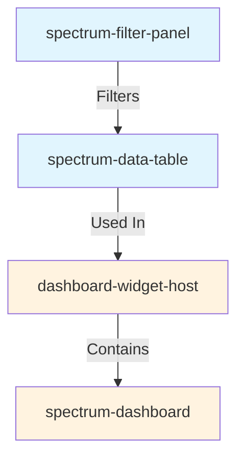

import { Meta } from '@storybook/addon-docs/blocks';

<Meta title="Spectrum/Components/SpectrumDataTable/Dependencies" />

# 🔗 SpectrumDataTable Dependencies

This document shows the dependency relationships for the spectrum-data-table component and how it integrates with other components in the Spectrum system.

---

## 📋 Component Usage Overview

**spectrum-data-table** is a feature-rich data table component with sorting, pagination, selection, and drill-down capabilities.

### Dependencies
- **None** (pure component with JSONata support)

### Components Using spectrum-data-table
- **spectrum-dashboard** - Table widget integration with filtering and drill-down
- **dashboard-widget-host** - Wraps table as dashboard widget

### Used By
- Dashboard applications for tabular data display
- Data analysis and reporting interfaces
- Admin panels and data management tools

---

## 🔍 Visual Dependencies



---

## 🏗️ Architecture Integration

### Dashboard Integration Pattern

```typescript
// Dashboard widget configuration
{
  "widgets": {
    "salesTable": {
      "component": "data-table",
      "dataSourceId": "salesData",
      "uiConfig": {
        "columns": [
          { "key": "product", "label": "Product", "sortable": true },
          { "key": "revenue", "label": "Revenue", "format": "currency", "align": "right" }
        ],
        "sortable": true,
        "pageable": true,
        "pageSize": 10,
        "selectable": true
      },
      "drillDown": {
        "action": "detail-panel",
        "targetPanel": "productDetails"
      }
    }
  }
}
```

### Filter Integration

```typescript
// Table updates automatically when filters change
<spectrum-filter-panel 
  filters={...}
  @filtersChanged=${updateTableData}
/>

<spectrum-data-table 
  data={filteredData}
  config={...}
/>
```

---

## 🔄 Event Flow

### Standard Component Events

**rowClick**
- Emitted when a table row is clicked
- Payload: `{ action: 'rowClick', row: any, index: number, data: any }`
- Integrated with dashboard drill-down manager

**selectionChange**
- Emitted when row selection changes
- Payload: `{ selectedRows: any[], selectedIds: string[] }`
- Supports multi-select and bulk operations

**sortChange**
- Emitted when sort order changes
- Payload: `{ column: string, direction: 'asc' | 'desc' }`

**pageChange**
- Emitted when page changes
- Payload: `{ page: number, pageSize: number }`

---

## 🚀 Integration Benefits

### Data Handling
- **JSONata Transforms**: Advanced data manipulation and formatting
- **Client-side Sorting**: Instant sorting without server requests
- **Pagination**: Efficient handling of large datasets
- **Selection**: Single or multi-row selection with events

### Consistency
- Uniform styling with Spectrum design system
- Consistent interaction patterns across applications
- Standard drill-down integration with dashboard

### Maintainability
- Declarative column configuration
- Centralized data formatting logic
- Easy to extend with custom formatters

### Performance
- Virtual scrolling for large datasets
- Efficient rendering with Stencil
- Minimal re-renders on data updates
- Lazy loading support

---

## 🔧 Development Considerations

### When Modifying spectrum-data-table
1. **Breaking Change Analysis** - Column config or event changes affect dashboard integration
2. **Performance Testing** - Test with large datasets (1000+ rows)
3. **Accessibility Testing** - Verify keyboard navigation and screen reader support
4. **Filter Compatibility** - Ensure filter integration remains functional
5. **Documentation Updates** - Update dashboard guide and examples

### When Adding New Features
1. Consider performance impact on large datasets
2. Maintain accessibility standards (keyboard nav, ARIA)
3. Update TypeScript types and interfaces
4. Document new configuration options
5. Add Storybook examples

---

**Integration Documentation** • [Component Dependencies Map](../../../README.md#component-dependency-map) • [Dashboard Integration Guide](../../spectrum-dashboard/IMPLEMENTATION-GUIDE.md#table-widget)


