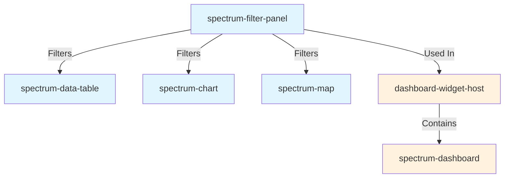

import { Meta } from '@storybook/addon-docs/blocks';

<Meta title="Spectrum/Components/SpectrumFilterPanel/Dependencies" />

# 🔗 SpectrumFilterPanel Dependencies

This document shows the dependency relationships for the spectrum-filter-panel component and how it integrates with other components in the Spectrum system.

---

## 📋 Component Usage Overview

**spectrum-filter-panel** is a flexible filtering component that provides client-side and server-side filtering capabilities for dashboard widgets and data tables.

### Dependencies
- **None** (pure component)

### Components Using spectrum-filter-panel
- **spectrum-dashboard** - Filter widget integration with global filter state
- **dashboard-widget-host** - Wraps filter panel as dashboard widget

### Used By
- Dashboard applications for data filtering
- Data analysis and reporting interfaces
- Search and discovery interfaces

---

## 🔍 Visual Dependencies



---

## 🏗️ Architecture Integration

### Dashboard Integration Pattern

```typescript
// Dashboard widget configuration
{
  "widgets": {
    "filters": {
      "component": "filter-panel",
      "uiConfig": {
        "layout": "horizontal",
        "immediate": true,
        "showButtons": false,
        "filters": [
          {
            "id": "region",
            "type": "select",
            "label": "Region",
            "options": [
              { "label": "All", "value": "" },
              { "label": "North", "value": "north" }
            ]
          },
          {
            "id": "dateRange",
            "type": "date-range",
            "label": "Date Range"
          }
        ]
      }
    }
  }
}
```

### Filter Coordination

```typescript
// Widgets subscribe to filter changes
<spectrum-filter-panel
  filters={config.filters}
  @filtersChanged=${(e) => {
    // Update all subscribed widgets
    updateWidgets(e.detail.filters);
  }}
/>
```

---

## 🔄 Event Flow

### Standard Component Events

**filtersChanged**
- Emitted when filter values change
- Payload: `{ filters: { [key: string]: any }, action: 'apply' | 'change' | 'clear' }`
- Triggers dashboard-wide filter update via DashboardStore

**filterCleared**
- Emitted when filters are cleared
- Triggers reset of all filtered widgets

---

## 🚀 Integration Benefits

### Filter Management
- **Declarative Configuration**: JSON-based filter definitions
- **Multiple Types**: Select, multi-select, date-range, text search, number range
- **Immediate Mode**: Real-time filtering without "Apply" button
- **Client/Server**: Supports both client-side and server-side filtering

### Consistency
- Uniform filter UI across applications
- Consistent behavior and interaction patterns
- Standard integration with dashboard state management

### Maintainability
- Centralized filter logic
- Easy to add new filter types
- Reusable across different data sources

### Performance
- Debounced input for efficient filtering
- Minimal re-renders on value changes
- Efficient state synchronization

---

## 🔧 Development Considerations

### When Modifying spectrum-filter-panel
1. **Breaking Change Analysis** - Filter config or event changes affect dashboard integration
2. **Performance Testing** - Test filter performance with large datasets
3. **Accessibility Testing** - Verify keyboard navigation and screen reader support
4. **Widget Compatibility** - Ensure all dashboard widgets can consume filter updates
5. **Documentation Updates** - Update dashboard guide and examples

### When Adding New Filter Types
1. Implement new filter type renderer
2. Add to FilterType union type
3. Update FilterConfig interface
4. Add validation logic
5. Document configuration options
6. Add Storybook examples

---

**Integration Documentation** • [Component Dependencies Map](../../../README.md#component-dependency-map) • [Dashboard Integration Guide](../../spectrum-dashboard/IMPLEMENTATION-GUIDE.md#filter-widget)


