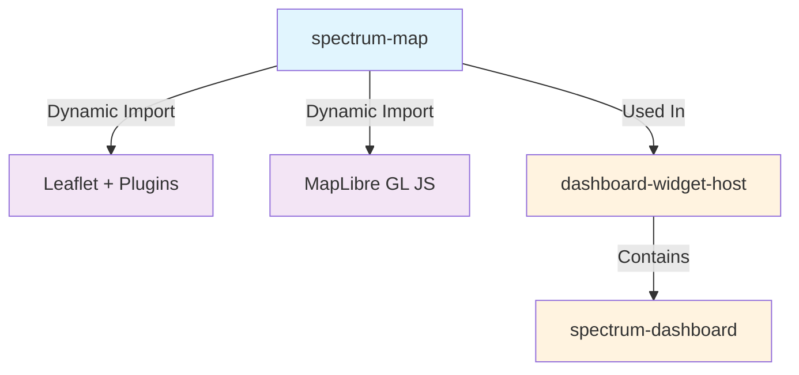

import { Meta } from '@storybook/addon-docs/blocks';

<Meta title="Spectrum/Components/SpectrumMap/Dependencies" />

# 🔗 SpectrumMap Dependencies

This document shows the dependency relationships for the spectrum-map component and how it integrates with other components in the Spectrum system.

---

## 📋 Component Usage Overview

**spectrum-map** is a dual-provider mapping component that dynamically loads either Leaflet or MapLibre GL JS for interactive map visualizations.

### External Dependencies
- **Leaflet** (~40KB) - Default, lightweight mapping library for raster tiles
- **leaflet.markercluster** - Marker clustering plugin
- **leaflet.heat** - Heatmap visualization plugin
- **MapLibre GL JS** (~200KB) - Modern vector mapping library with GPU acceleration

### Components Using spectrum-map
- **spectrum-dashboard** - Map widget integration with drill-down support
- **dashboard-widget-host** - Wraps map as dashboard widget

### Used By
- Dashboard applications requiring geographic data visualization
- Location-based analytics and reporting
- Store locator and territory management interfaces

---

## 🔍 Visual Dependencies



---

## 🏗️ Architecture Integration

### Dual-Provider Pattern
The spectrum-map component uses an adapter pattern to support multiple mapping providers:

```typescript
// Provider selection via prop
<spectrum-map 
  map-provider="leaflet"  // or "maplibre"
  config={...}
  data={...}
/>

// Dynamic adapter loading
async componentWillLoad() {
  if (this.mapProvider === 'leaflet') {
    const { LeafletAdapter } = await import('./adapters/leaflet-adapter');
    this.adapter = new LeafletAdapter(this.element);
  } else if (this.mapProvider === 'maplibre') {
    const { MapLibreAdapter } = await import('./adapters/maplibre-adapter');
    this.adapter = new MapLibreAdapter(this.element);
  }
}
```

### Dashboard Integration Pattern

```typescript
// Dashboard widget configuration
{
  "widgets": {
    "salesMap": {
      "component": "map",
      "dataSourceId": "locations",
      "uiConfig": {
        "mapProvider": "leaflet",
        "center": [40.7128, -74.0060],
        "zoom": 10,
        "clustering": { "enabled": true }
      },
      "drillDown": {
        "action": "cross-filter",
        "filterMappings": {
          "id": "storeId"
        }
      }
    }
  }
}
```

---

## 🔄 Event Flow

### Standard Component Events

**markerClick**
- Emitted when a map marker is clicked
- Payload: `{ action: 'markerClick', marker: MarkerConfig, data: any, originalEvent: Event }`
- Integrated with dashboard drill-down manager

**regionClick**
- Emitted when a polygon/region is clicked
- Payload: `{ action: 'regionClick', region: RegionConfig, data: any, originalEvent: Event }`
- Supports territory-based drill-down patterns

---

## 🚀 Integration Benefits

### Bundle Optimization
- **Lazy Loading**: Map libraries only loaded when needed
- **Provider Choice**: Select Leaflet (40KB) or MapLibre (200KB) based on requirements
- **Code Splitting**: Dynamic imports reduce initial bundle size by 40-200KB

### Consistency
- Uniform API regardless of provider selection
- Same event structure for drill-down integration
- Consistent JSON configuration format

### Maintainability  
- Adapter pattern isolates provider-specific code
- Easy to add new providers without breaking changes
- Centralized map logic in component, not scattered across app

### Performance
- GPU acceleration with MapLibre for complex visualizations
- Efficient clustering reduces DOM nodes for large datasets
- Optimized rendering for both raster and vector tiles

---

## 🔧 Development Considerations

### When Modifying spectrum-map
1. **Provider Parity** - Ensure both adapters support the same feature set
2. **Breaking Change Analysis** - Config or event changes affect dashboard integration
3. **Comprehensive Testing** - Test with both Leaflet and MapLibre providers
4. **Performance Testing** - Verify performance with large datasets (1000+ markers)
5. **Documentation Updates** - Update dashboard implementation guide and examples

### When Adding New Features
1. Implement in adapter interface first
2. Add to both Leaflet and MapLibre adapters
3. Update TypeScript types
4. Add configuration to `MapConfig` interface
5. Document in README and implementation guide
6. Add Storybook example

---

**Integration Documentation** • [Component Dependencies Map](../../../README.md#component-dependency-map) • [Dashboard Integration Guide](../../spectrum-dashboard/IMPLEMENTATION-GUIDE.md#map-widget)


