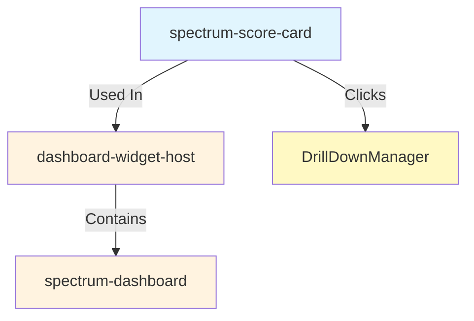

import { Meta } from '@storybook/addon-docs/blocks';

<Meta title="Spectrum/Components/SpectrumScoreCard/Dependencies" />

# 🔗 SpectrumScoreCard Dependencies

This document shows the dependency relationships for the spectrum-score-card component and how it integrates with other components in the Spectrum system.

---

## 📋 Component Usage Overview

**spectrum-score-card** is a flexible Key Performance Indicator (KPI) display component that shows metrics with trends, comparisons, and visual indicators.

### Dependencies
- **None** (pure component)

### Components Using spectrum-score-card
- **spectrum-dashboard** - KPI widget integration with drill-down support
- **dashboard-widget-host** - Wraps score card as dashboard widget

### Used By
- Dashboard applications for KPI visualization
- Executive summary dashboards
- Performance monitoring interfaces
- Analytics and reporting tools

---

## 🔍 Visual Dependencies



---

## 🏗️ Architecture Integration

### Dashboard Integration Pattern

```typescript
// Dashboard widget configuration
{
  "widgets": {
    "revenueKPI": {
      "component": "score-card",
      "dataSourceId": "kpiData",
      "uiConfig": {
        "label": "Total Revenue",
        "value": "$2.5M",
        "variant": "primary",
        "icon": "attach_money",
        "trend": {
          "value": 12.5,
          "direction": "up",
          "isPositive": true,
          "label": "vs last month"
        },
        "subtitle": "Q4 2024"
      },
      "drillDown": {
        "action": "dashboard-nav",
        "targetDashboardId": "revenueDetails"
      }
    }
  }
}
```

### Dynamic Data Binding

```typescript
// Score card updates automatically with data source changes
<spectrum-score-card
  label="Active Users"
  value=${data.activeUsers}
  trend=${calculateTrend(data.current, data.previous)}
  @scoreCardClick=${handleDrillDown}
/>
```

---

## 🔄 Event Flow

### Standard Component Events

**scoreCardClick**
- Emitted when the score card is clicked
- Payload: `{ action: 'scoreCardClick', config: ScoreCardConfig, data: any }`
- Integrated with dashboard drill-down manager for navigation

---

## 🚀 Integration Benefits

### Visual Communication
- **At-a-Glance Metrics**: Instant KPI visibility
- **Trend Indicators**: Up/down/neutral with visual cues
- **Color Coding**: Variant-based styling (primary, success, warning, danger)
- **Icon Support**: Material icons for visual context

### Consistency
- Uniform KPI display across applications
- Standard trend visualization patterns
- Consistent interaction behavior with drill-down

### Maintainability
- Declarative configuration
- Easy to update with new data
- Reusable across different metrics

### Performance
- Lightweight rendering
- Minimal DOM overhead
- Efficient updates on data changes

---

## 🔧 Development Considerations

### When Modifying spectrum-score-card
1. **Visual Consistency** - Changes affect appearance across all dashboards
2. **Breaking Change Analysis** - Config or event changes affect dashboard integration
3. **Accessibility Testing** - Verify keyboard navigation and screen reader support
4. **Trend Calculations** - Ensure trend logic remains accurate
5. **Documentation Updates** - Update dashboard guide and examples

### When Adding New Features
1. Consider visual impact on dashboard layouts
2. Maintain accessibility standards (ARIA labels, keyboard nav)
3. Update TypeScript types and interfaces
4. Document new configuration options
5. Add Storybook examples with real-world use cases

---

**Integration Documentation** • [Component Dependencies Map](../../../README.md#component-dependency-map) • [Dashboard Integration Guide](../../spectrum-dashboard/IMPLEMENTATION-GUIDE.md#score-card-widget)


